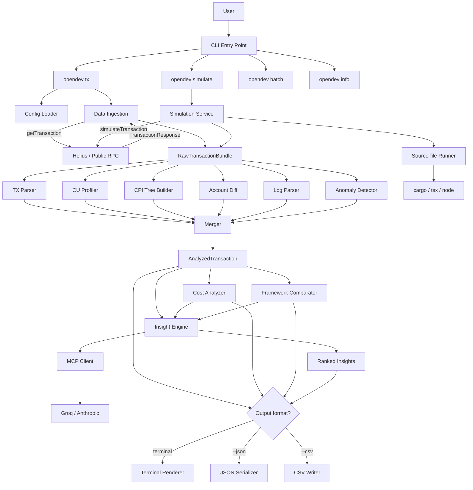
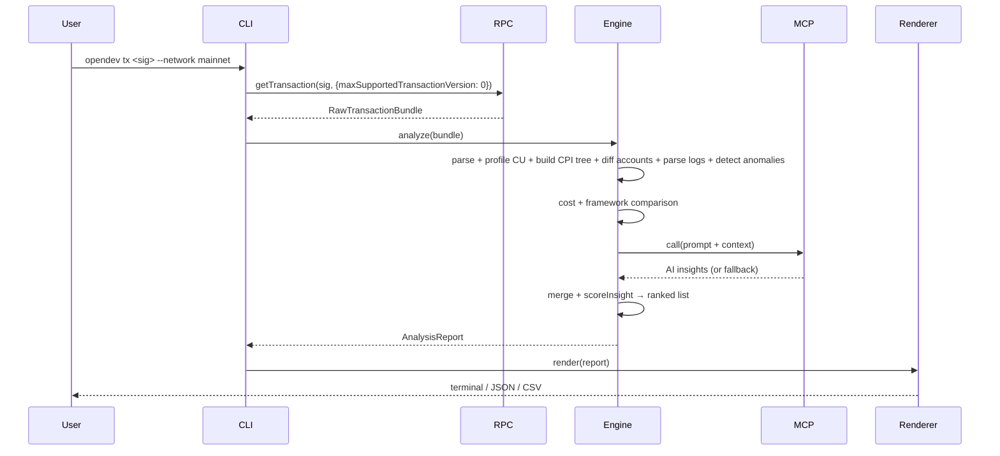

# OPEN — Architecture

Solana transaction debugger and profiler. This document covers the pipeline that powers both the `opendev` CLI and the web frontend — they share one analysis engine.

## Table of Contents

1. [High-level architecture](#1-high-level-architecture)
2. [Component breakdown](#2-component-breakdown)
3. [Tech stack](#3-tech-stack)
4. [Data flow](#4-data-flow)
5. [Diagrams](#5-diagrams)
6. [Repository structure](#6-repository-structure)
7. [Key design decisions](#7-key-design-decisions)

---

## 1. High-level architecture

The pipeline is a sequential chain from a transaction signature (or a transaction blob, for `simulate`) to a rendered report. Each stage consumes the output of the previous one.

```
┌──────────────────────────────────────────────────────────┐
│                    CLI ENTRY POINT                       │
│  opendev tx | simulate | batch | info | config | login   │
└──────────────────────────┬───────────────────────────────┘
                           ▼
┌──────────────────────────────────────────────────────────┐
│               SOLANA DATA INGESTION                      │
│   RPC client → getTransaction / simulateTransaction      │
│   IDL cache (~/.open-cli/cache/idls/v1, 24h TTL)         │
└──────────────────────────┬───────────────────────────────┘
                           ▼
┌──────────────────────────────────────────────────────────┐
│                  CORE ANALYSIS ENGINE                    │
│  ┌──────────┐ ┌──────────┐ ┌──────────────────────────┐  │
│  │TX Parser │ │CU Profile│ │  CPI Tree Builder        │  │
│  └──────────┘ └──────────┘ └──────────────────────────┘  │
│  ┌──────────┐ ┌──────────┐ ┌──────────────────────────┐  │
│  │Acct Diff │ │Log Parser│ │ Anomaly Detector         │  │
│  └──────────┘ └──────────┘ └──────────────────────────┘  │
└──────────────────────────┬───────────────────────────────┘
                           ▼
┌──────────────────────────────────────────────────────────┐
│             COST ANALYZER · FRAMEWORK COMPARATOR         │
│   USD per transfer · CU $ cost · Anchor/Native/Pinocchio │
└──────────────────────────┬───────────────────────────────┘
                           ▼
┌──────────────────────────────────────────────────────────┐
│                    INSIGHT ENGINE                        │
│  Rule layer (deterministic) + MCP layer (Groq/Anthropic) │
│  Ranked insights (severity + actionability + source)     │
└──────────────────────────┬───────────────────────────────┘
                           ▼
┌──────────────────────────────────────────────────────────┐
│                   OUTPUT RENDERER                        │
│      Terminal (chalk + cli-table3) · JSON · CSV          │
└──────────────────────────────────────────────────────────┘
```

The same engine drives `opendev tx <sig>`, `opendev simulate <input>`, and the per-row analysis inside `opendev batch <file>`. The web frontend calls the engine over HTTP via the `api/` package.

---

## 2. Component breakdown

### 2.1 CLI entry point

**Responsibility.** Parse arguments, route to a sub-command, load configuration, render output. Commands: `tx`, `simulate`, `batch`, `info`, `config`, `login`.

**Tech.** `commander` for argument parsing, `dotenv` for env vars, custom credential store at `~/.opendev/credentials.json` (chmod 600) for AI provider keys.

### 2.2 Solana data ingestion

**Responsibility.** Fetch a confirmed transaction by signature, or simulate an unsigned one. Always sets `maxSupportedTransactionVersion: 0` and prefers `commitment: "confirmed"`.

**Tech.** `@solana/web3.js` for `getTransaction` / `simulateTransaction`. Optional Helius RPC for richer parsed data and higher rate limits. `withRetry` wraps RPC calls with 3 exponential-backoff attempts.

**Output.** `RawTransactionBundle` — the full transaction response plus pre/post balances, log messages, and inner instructions.

### 2.3 Transaction parser

**Responsibility.** Decode raw instructions into human-readable form: map program IDs to friendly names, decode Anchor instructions via IDL, correlate top-level instructions with their CPI children.

**Tech.** `@coral-xyz/anchor` for IDL-based decoding, `@solana/spl-token` for token-program instructions, `borsh` for manual struct deserialization when no IDL is available.

Per-protocol decoders live in `services/src/analysis/decoders/`. See [Decoders.md](Decoders.md) for the registry schema and the workflow to add a new one.

### 2.4 Compute Unit profiler

**Responsibility.** Walk the log messages, find `Program X consumed Y of Z compute units` lines, and attribute CU to each instruction + CPI child.

**Tech.** Pure TypeScript regex.

```typescript
const CU_REGEX = /Program (\S+) consumed (\d+) of (\d+) compute units/;
```

**Output.** A `CUProfile` with totals, per-instruction breakdown, and the identified bottleneck (the single program that consumed the most CU).

### 2.5 CPI tree builder

**Responsibility.** Reconstruct the hierarchical tree of program invocations from Solana's depth-based `invoke [N]` log markers.

**Algorithm.** Stack-based:

```
stack = []
for each log line:
  if line matches "Program X invoke [N]":
    push node(X, depth=N) to stack
  if line matches "Program X success" or "Program X failed":
    pop from stack → attach as child to parent at depth N-1
  if line matches "Program X consumed N of M compute units":
    attach CU to top-of-stack node
```

**Output.** A `CPITree` with a root node and recursive children, each tagged with depth, CU, and success state.

### 2.6 Account diff engine

**Responsibility.** Compute before/after deltas for every account touched: SOL balance changes, SPL token balance changes, role (signer / writable / readonly).

**Tech.** `@solana/spl-token` for token account decoding, `bignumber.js` for precise lamport arithmetic.

### 2.7 Log parser

**Responsibility.** Group raw Solana log messages by originating program, strip the `Program log:` prefix from `msg!()` calls, and surface error codes.

**Tech.** Pure TypeScript regex + state machine.

### 2.8 Anomaly detector

**Responsibility.** Static rule-based detection of suspicious patterns. Three rules: `spam` (unverified mint, > 1M volume), `mev-like` (3+ programs + swap keyword + nested invokes), `nondeterministic` (failed transaction that consumed CU).

Runs synchronously after the core analyzers, before the insight engine. Full reference and quality measurements in [Anomaly_Detection.md](Anomaly_Detection.md).

### 2.9 Cost analyzer

**Responsibility.** Convert raw token deltas into per-transfer USD impact, and compute the fee in SOL and USD.

**Tech.** Jupiter Price API (cached per session) for SOL and token prices, `bignumber.js` for precision.

**Output.** Per-transfer cost rows (`from`, `to`, `tokenSymbol`, `usdValue`) plus a `CUCostBreakdown` (consumed CU × priority fee → SOL → USD).

### 2.10 Framework comparator

**Responsibility.** Given the identified programs and their CU consumption, estimate what the same workload would cost under Anchor / Native / Pinocchio.

**Tech.** Static benchmark registry at `services/src/data/framework-benchmarks.json`. Validator at `scripts/validate-benchmarks.ts`.

**Output.** A `FrameworkComparison` with per-framework estimated CU and a delta vs the detected framework.

### 2.11 Insight engine

**Responsibility.** Produce a ranked list of recommendations from two sources:

1. **Rule layer** (deterministic, always runs): `CU_BOTTLENECK`, `CU_WASTE`, `BUDGET_RISK`, `EXECUTION_FAILURE`, `DEEP_CPI`, `CU_ATTRIBUTION_LOW_CONFIDENCE`.
2. **MCP layer** (AI, optional): a prompt sent to Groq or Anthropic via the MCP client. The prompt embeds a curated knowledge base of CU-optimization techniques with primary sources.

When a rule and the AI agree on the same issue, the engine merges them into a single `hybrid` insight — the strongest signal. The ranking function (`scoreInsight` in `services/src/analysis/insightEngine.ts`) combines severity, actionability bonuses, source weight, and tag intent.

Full prompt-source bibliography, ranking algorithm, and MCP wire format: [AI_Insights.md](AI_Insights.md).

### 2.12 MCP client

**Responsibility.** Wrap the configured AI provider's API. Read the resolved provider config (`GROQ_API_KEY`, `ANTHROPIC_API_KEY`, or `MCP_ENDPOINT_URL` for a custom endpoint), handle auth, retry, timeout.

**Tech.** `axios` for HTTP, `zod` for runtime validation of the AI response shape.

**Fallback.** If no provider is configured or the network call fails, the engine degrades gracefully to rule-based insights only.

### 2.13 Simulation service

**Responsibility.** Accept any of:
- a base64-encoded serialized transaction,
- a `.b64` / `.json` file containing one,
- a source file (`.rs`, `.ts`, `.mts`, `.cts`, `.js`, `.mjs`, `.cjs`) or Rust project directory that builds and prints a base64 transaction on stdout.

Routes it through Solana's `simulateTransaction` RPC with `sigVerify: false` and `replaceRecentBlockhash: true`, then feeds the result back into the same pipeline as `opendev tx`. Triggered by `opendev simulate`.

**Source-file runner.** When the input is a source file, the runner spawns the right toolchain (`cargo run --release`, `npx -y tsx`, or `node`), captures stdout, and extracts the last non-empty base64-looking line. A yellow `EXECUTING USER CODE` banner is shown before the spawn. `--no-exec` disables source execution entirely (useful in CI).

See the README's "Source-file runners" section for usage examples and the TypeScript top-level-await caveat.

### 2.14 IDL cache

**Responsibility.** Cache Anchor IDLs locally to avoid re-fetching on every run. Stored at `~/.open-cli/cache/idls/v1/<programId>.json` with a 24-hour TTL and a SHA-256 checksum per entry. Corrupt or expired entries trigger a re-fetch.

**Performance impact.** Warm-cache runs are ~40–60% faster than cold runs for transactions touching multiple Anchor programs. See [Performance_and_Quality.md](Performance_and_Quality.md) for measured latencies.

`--no-cache` bypasses the cache for a single run.

### 2.15 Configuration loader

**Responsibility.** Resolve configuration from a layered set of sources in priority order:

```
1. CLI flags                          (e.g. --rpc, --network)
2. Environment variables              (GROQ_API_KEY, HELIUS_API_KEY, OPEN_RPC_URL)
3. .env in current working directory
4. ~/.opendev/credentials.json        (AI provider keys, chmod 600)
5. Built-in defaults                  (public mainnet RPC, no AI provider)
```

Credential storage is managed by `opendev login` and `opendev config set-key`. The CLI never logs the key value; only the key source ("env" vs "credentials file") is shown in `opendev config get-key`.

### 2.16 Output renderer

**Responsibility.** Render the final report. Three formats:

- **Terminal** — `chalk` for colors, `cli-table3` for tables. Direct `console.log` calls (no Ink) for Windows compatibility.
- **JSON** — full structured output (`--json`). Stable schema, suitable for piping into `jq` or scripting.
- **CSV** — flat row-per-transaction (`--csv`). Default file name: `<signature>.csv`.

---

## 3. Tech stack

| Layer | Tech | Notes |
|---|---|---|
| CLI + engine | TypeScript (Node 20+) | Fast iteration, best Solana SDK support |
| Argument parsing | `commander` | Sub-command routing |
| Solana RPC | `@solana/web3.js`, optional Helius | Helius for parsed APIs and higher rate limits |
| Anchor IDL | `@coral-xyz/anchor` | IDL-based instruction decoding |
| Token decoding | `@solana/spl-token` | Native SPL Token + Token-2022 |
| HTTP | `axios` | Helius enhanced APIs, MCP transport |
| Validation | `zod` | AI response schema + config |
| Number precision | `bignumber.js` | Lamport / token amount math |
| Terminal output | `chalk`, `cli-table3`, `ora` | Plain `console.log` (no Ink) |
| Bundling | `tsup` | Single-file CLI binary |
| Tests | `vitest` | Fixture-based, locale-pinned |

### RPC providers

| Provider | Use | Notes |
|---|---|---|
| Helius | Recommended | Parsed transaction APIs, high rate limits, free tier |
| Public RPC | Fallback | `api.mainnet-beta.solana.com` — rate-limited |
| Custom | Power users | Set via `OPEN_RPC_URL` or `--rpc` |

---

## 4. Data flow

### `opendev tx <signature>`

```
1. CLI Entry Point
   ├── Parse signature, network, flags
   ├── Load config (env → .env → credentials → defaults)
   └── Call ingestTransaction(signature, options)

2. Data Ingestion
   ├── connection.getTransaction(sig, { maxSupportedTransactionVersion: 0 })
   └── Returns RawTransactionBundle

3. Core Analysis (parallel within the merger)
   ├── txParser.parse(bundle)         → ParsedTransaction
   ├── cuProfiler.profile(bundle)     → CUProfile
   ├── cpiTreeBuilder.build(bundle)   → CPITree
   ├── accountDiff.compute(bundle)    → AccountDiff[]
   ├── logParser.parse(bundle)        → ParsedLogs
   └── anomalyDetector.detect(bundle) → AnomalyReport

4. Merge → AnalyzedTransaction

5. Cost Analyzer → CostAnalysis

6. Framework Comparator → FrameworkComparison

7. Insight Engine
   ├── ruleEngine.analyze(analyzedTx, costAnalysis, frameworkComparison)
   ├── mcpClient.call(prompt + context)   ← optional
   ├── Merge rule + MCP insights (hybrid when both agree)
   └── scoreInsight → ranked Insight[]

8. Output Renderer
   ├── --json → JSON serializer
   ├── --csv  → CSV writer
   └── default → terminal renderer
```

### `opendev simulate <input>`

```
1. CLI Entry Point
   └── detectInputKind(input) → base64 | path | rust-source | ts-source | js-source

2. Source-file runner (only for source inputs)
   ├── Spawn cargo / tsx / node
   ├── Capture stdout
   └── Extract last base64-looking line

3. Simulation Service
   ├── connection.simulateTransaction(tx, { sigVerify: false, replaceRecentBlockhash: true })
   └── Returns RawTransactionBundle (same shape as confirmed-tx ingestion)

4. → Same pipeline as `tx` from step 3 onward
```

### `opendev batch <file>`

```
1. Read signatures from JSON file
2. For each signature, run the `tx` pipeline
3. batchAggregator computes totals, top bottlenecks, common insights
4. Emit JSON / CSV report
```

---

## 5. Diagrams

### 5.1 System architecture



### 5.2 Request sequence (`opendev tx`)



---

## 6. Repository structure

```
opendev/
├── README.md
├── CONTRIBUTING.md
├── CHANGELOG.md
├── package.json                  # npm workspaces root
├── tsconfig.base.json
├── .env.example
│
├── cli/                          # CLI binary (published as `opendev`)
│   ├── bin/open.ts
│   └── src/
│       ├── commands/             # tx, simulate, batch, info, config, login
│       ├── config/
│       ├── renderers/            # terminal, json, csv
│       └── utils/
│
├── services/                     # Analysis engine, imported by cli/ and api/
│   └── src/
│       ├── analysis/             # txParser, cuProfiler, cpiTreeBuilder,
│       │                         # accountDiff, logParser, anomalyDetector,
│       │                         # costAnalyzer, frameworkComparator,
│       │                         # insightEngine, merger, batchAggregator
│       ├── analysis/decoders/    # Per-protocol decoders (see Decoders.md)
│       ├── solana/               # rpc, connection, idlcache,
│       │                         # simulationService, sourceRunner, programs
│       ├── mcp/                  # client, prompts, anthropic, groq, mcpInsightProvider
│       └── data/                 # program-registry.json, framework-benchmarks.json
│
├── api/                          # Thin HTTP wrapper for the web frontend
├── web/                          # React frontend (work in progress)
├── scripts/                      # validate-decoders, validate-registry, bench-latency
├── docs/                         # This folder
└── benchmarks/                   # latency-results.json (generated)
```

Dependency graph:

```
cli  →  services
api  →  services
web  →  api (HTTP)
```

---

## 7. Key design decisions

| Decision | Choice | Rationale |
|---|---|---|
| Language | TypeScript (Node 20+) | Best Solana SDK support; CPU-light pipeline (RPC I/O dominates) |
| CU attribution | Log parsing | Works on real mainnet/devnet transactions without re-simulation |
| Insight engine | Hybrid (rules + MCP) | Rules are deterministic and offline; MCP adds code-level depth |
| MCP fallback | Graceful degradation | If no provider configured or network down, rule-based insights still render |
| AI providers | Groq (default), Anthropic, custom MCP endpoint | Groq free tier is the zero-friction path; users can swap |
| Cost prices | Jupiter Price API | Accurate real-time prices, free tier sufficient |
| Framework benchmarks | Static JSON registry | Versioned, auditable, fast; validator enforces schema |
| Spam detection | Heuristic (unverified mint + > 1M volume) | High precision in tests; safe-mint allowlist for USDC/USDT/wSOL |
| Simulation provider | Solana's `simulateTransaction` RPC | Native, no external dependency, supports versioned transactions |
| CPI tree algorithm | Stack-based log parsing | `invoke [N]` depth markers are reliable and always present |
| Terminal renderer | `chalk` + `cli-table3` (no Ink) | Plain `console.log` avoids Windows double-render issues |
| IDL caching | Local filesystem, 24h TTL, SHA-256 checksum | ~40–60% latency reduction on warm runs |
| Distribution | npm global install (`opendevtool` package, `opendev` binary) | Zero-friction install; aligns with CLI-first strategy |
| Testing | Fixture-based + locale-pinned snapshots | Deterministic across machines, no rate limits |
| Workspaces layout | `cli`, `services`, `api`, `web` | Engine is the single import target; surfaces share it |

---

## See also

- [Use_Cases.md](Use_Cases.md) — copy-paste workflows for the four main reasons to reach for `opendev`.
- [Decoders.md](Decoders.md) — program registry schema and the step-by-step for adding a new protocol decoder.
- [AI_Insights.md](AI_Insights.md) — prompt knowledge base sources, insight-ranking algorithm, MCP wire format.
- [Anomaly_Detection.md](Anomaly_Detection.md) — anomaly types, thresholds, and quality measurements.
- [Performance_and_Quality.md](Performance_and_Quality.md) — end-to-end latency benchmarks and test coverage.
- [Troubleshooting.md](Troubleshooting.md) — the 10 most common failures and how to fix them.
