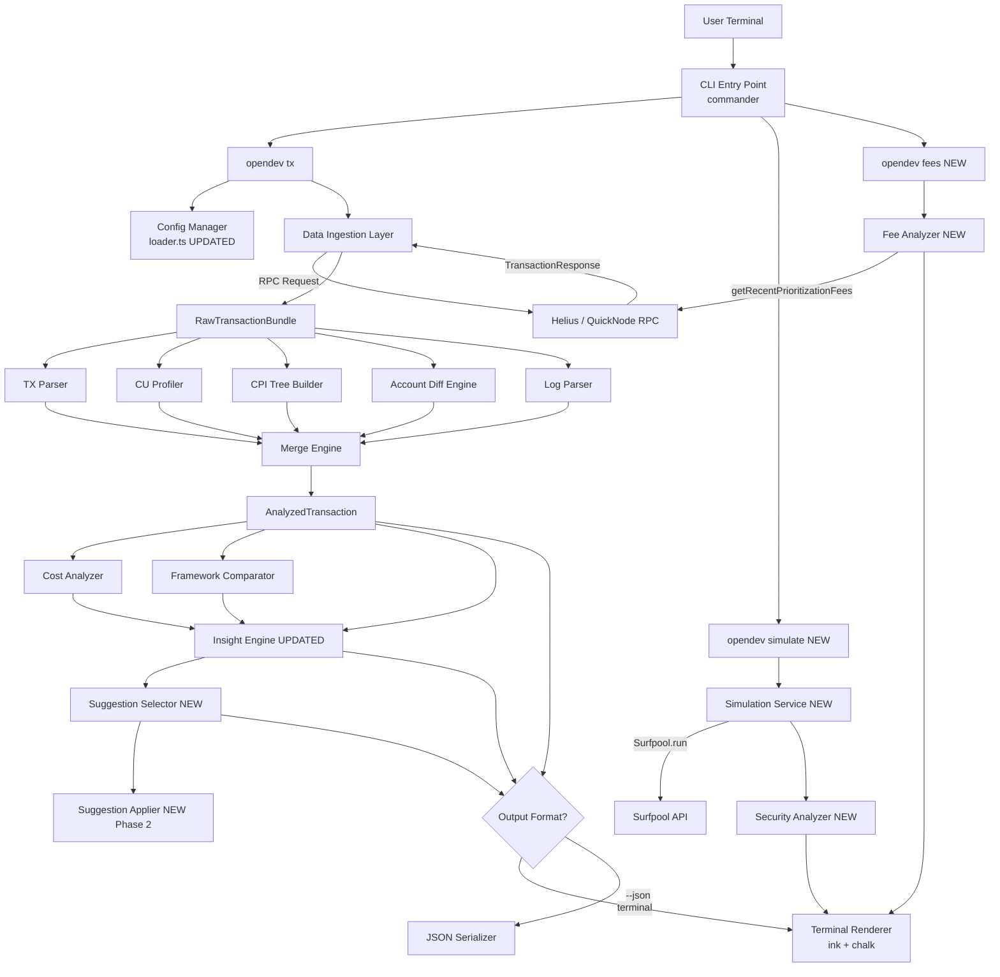
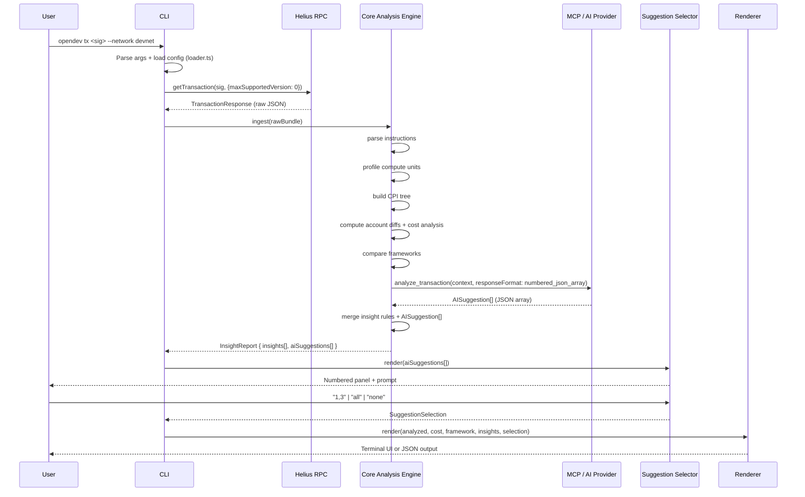
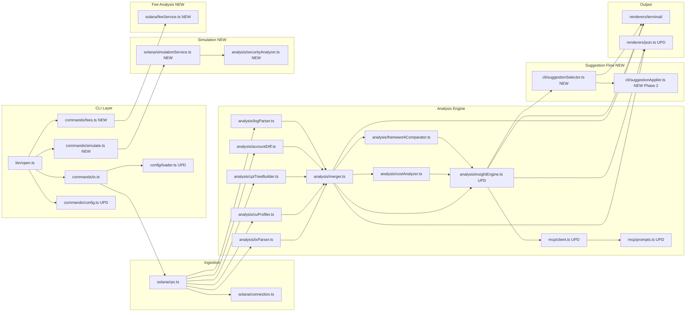

# OPEN — CLI Architecture Design
### Solana Transaction Debugger & Profiler · Hackathon MVP · 30-Day Build Plan

---

## Table of Contents

1. [High-Level System Architecture](#1-high-level-system-architecture)
2. [Detailed Component Breakdown](#2-detailed-component-breakdown)
3. [Suggested Tech Stack](#3-suggested-tech-stack)
4. [Data Flow](#4-data-flow)
5. [Visual Architecture Diagrams](#5-visual-architecture-diagrams)
6. [Repository Structure](#6-repository-structure)
7. [30-Day Build Plan](#7-30-day-build-plan)
8. [Appendix: Key Design Decisions](#8-appendix-key-design-decisions)

---

## 1. High-Level System Architecture

The OPEN CLI is composed of **eleven primary layers** that form a sequential pipeline from user input to rendered output. The architecture has been expanded to incorporate an **AI-powered Insight MCP Layer**, a dedicated **Cost Analyzer**, a **Simulation Service**, a **Fee Analyzer**, and a **Numbered Suggestion Selector** that gives developers fine-grained control over which AI suggestions to apply.

```
┌─────────────────────────────────────────────────────────────┐
│                      CLI ENTRY POINT                        │
│    opendev tx <sig>  |  opendev simulate <tx>  |  opendev fees       │
└──────────────────────────┬──────────────────────────────────┘
                            │
                            ▼
┌─────────────────────────────────────────────────────────────┐
│              SOLANA DATA INGESTION LAYER                    │
│      RPC Client → fetchTransaction + getAccountInfo         │
└──────────────────────────┬──────────────────────────────────┘
                            │
                            ▼
┌─────────────────────────────────────────────────────────────┐
│                  CORE ANALYSIS ENGINE                       │
│  ┌────────────┐ ┌────────────┐ ┌─────────────────────────┐  │
│  │ TX Parser  │ │ CU Profiler│ │   CPI Tree Builder      │  │
│  └────────────┘ └────────────┘ └─────────────────────────┘  │
│  ┌────────────┐ ┌────────────┐                              │
│  │Account Diff│ │ Log Parser │                              │
│  └────────────┘ └────────────┘                              │
└──────────────────────────┬──────────────────────────────────┘
                            │
                            ▼
┌─────────────────────────────────────────────────────────────┐
│                   COST ANALYZER                             │
│    Per-transfer USD value · Fee breakdown · CU cost in $    │
└──────────────────────────┬──────────────────────────────────┘
                            │
                            ▼
┌─────────────────────────────────────────────────────────────┐
│               FRAMEWORK COMPARATOR                          │
│    Anchor vs alternatives · Estimated CU delta per fw       │
└──────────────────────────┬──────────────────────────────────┘
                            │
                            ▼
┌─────────────────────────────────────────────────────────────┐
│         INSIGHT ENGINE  [UPDATED — MCP-powered]             │
│   AI code suggestions · Rule-based bottleneck detection     │
│   Returns numbered suggestion list (not free-form prose)    │
└──────────────────────────┬──────────────────────────────────┘
                            │
                            ▼
┌─────────────────────────────────────────────────────────────┐
│         SUGGESTION SELECTOR  [NEW]                          │
│   Numbered display · 1 / 2 / 3 / all / none input           │
│   Applies selected diffs → Suggestion Applier (Phase 2)     │
└──────────────────────────┬──────────────────────────────────┘
                            │
                            ▼
┌─────────────────────────────────────────────────────────────┐
│                    OUTPUT RENDERER                          │
│         Terminal (ink/chalk) ←→ JSON (--json flag)          │
└─────────────────────────────────────────────────────────────┘

  ┌─────────────────────────────────────────────────────────┐
  │            SIMULATION SERVICE  [NEW]  (opendev simulate)   │
  │   Surfpool.run integration · Security analysis engine   │
  └─────────────────────────────────────────────────────────┘

  ┌─────────────────────────────────────────────────────────┐
  │            FEE ANALYZER  [NEW]  (opendev fees)             │
  │   getRecentPrioritizationFees · Eco/Normal/Fast/Turbo   │
  └─────────────────────────────────────────────────────────┘
```

### How Components Interact

- The **CLI Entry Point** parses arguments and flags, then routes to the appropriate sub-command: `tx`, `simulate`, or `fees`.
- The **Data Ingestion Layer** fetches raw transaction data from Helius or QuickNode and passes it as a raw transaction object to the **Core Analysis Engine**.
- The **Core Analysis Engine** runs five parallel sub-modules: TX Parser, CU Profiler, CPI Tree Builder, Account Diff Engine, and Log Parser. Each produces a typed data structure.
- The five typed outputs are merged into a single **`AnalyzedTransaction`** object.
- The **Cost Analyzer** computes the USD/SOL financial impact of each individual transfer within the transaction, broken down per recipient.
- The **Framework Comparator** receives the CU profile and instruction metadata, then queries a framework benchmark registry to estimate how much CU the same logic would consume under alternative frameworks.
- The **Insight Engine** receives the `AnalyzedTransaction`, `CostAnalysis`, and `FrameworkComparison`, calls the MCP server, and returns a **structured, numbered list** of `AISuggestion` objects — not free-form prose.
- The **Suggestion Selector** renders this numbered list in the terminal, accepts user input (`1`, `1,3`, `all`, `none`), and passes selected items to the **Suggestion Applier** (Phase 2) for optional file patching.
- The **Simulation Service** is an independent pipeline triggered by `opendev simulate`. It sends a base64-encoded transaction to Surfpool.run and runs the Security Analysis Engine on the result.
- The **Fee Analyzer** is an independent pipeline triggered by `opendev fees`. It calls `getRecentPrioritizationFees` and returns fee profiles for the four speed tiers.
- The final enriched object is passed to the **Output Renderer**, which either renders a rich terminal UI or serializes to JSON.

---

## 2. Detailed Component Breakdown

### 2.1 CLI Entry Point  `[UPDATED]`

**Responsibility:** Parse commands, flags, and arguments. Route to the appropriate sub-command handler. Manage configuration (RPC URL, output format, network, AI provider). Now registers three top-level commands: `tx`, `simulate`, and `fees`.

**Technologies:**
- `commander` — argument parsing and sub-command routing
- `dotenv` — environment variable management for RPC keys
- `conf` — persistent local config store (saves preferred RPC endpoint, network, AI provider)

**Input:** Raw `argv` from the terminal.

**Output:** A structured `CLIOptions` object:

```typescript
interface CLIOptions {
  signature: string;
  network: "mainnet" | "devnet" | "testnet";
  rpcUrl: string;
  outputFormat: "terminal" | "json";
  verbose: boolean;
}
```

**Registered commands:**

```
opendev tx <signature>            # Full transaction analysis
opendev simulate <base64-tx>      # [NEW] Pre-flight security simulation
opendev fees                      # [NEW] Priority fee market overview
opendev config set rpc <url>      # RPC endpoint config
opendev config set ai <provider>  # [NEW] AI provider config
```

**Dependencies:** None (entry point).

---

### 2.2 Solana Data Ingestion Layer

**Responsibility:** Fetch all raw data from the Solana RPC required for analysis. This includes the full transaction with metadata, pre/post account states, and program account info.

**Technologies:**
- `@solana/web3.js` — `Connection.getTransaction()` with `maxSupportedTransactionVersion: 0`
- Helius RPC (primary) or QuickNode (fallback)
- `axios` — for Helius-specific enhanced APIs

**Input:** Transaction signature string + network config.

**Output:** `RawTransactionBundle` containing:

```typescript
interface RawTransactionBundle {
  transaction: TransactionResponse;
  preBalances: number[];
  postBalances: number[];
  preTokenBalances: TokenBalance[];
  postTokenBalances: TokenBalance[];
  logMessages: string[];
  accountKeys: PublicKey[];
  innerInstructions: InnerInstruction[];
  computeUnitsConsumed: number;
}
```

**Important:** Always request `commitment: "confirmed"` or `"finalized"` and set `maxSupportedTransactionVersion: 0` to support versioned transactions and Address Lookup Tables (ALTs).

---

### 2.3 Transaction Parser

**Responsibility:** Decode the raw transaction into structured, human-readable instructions. Map each instruction to its program, decode instruction data via IDL for Anchor programs, and correlate top-level instructions with their CPI children.

**Technologies:**
- `@coral-xyz/anchor` — IDL-based instruction decoding
- `@solana/spl-token` — Token Program instruction decoding
- `borsh` — for manual struct deserialization when no IDL is available

**Output:** `ParsedTransaction`:

```typescript
interface ParsedInstruction {
  index: number;
  programId: string;
  programName: string;
  instructionName: string;
  accounts: AccountMeta[];
  decodedData: Record<string, unknown> | null;
  computeUnits: number;
  logs: string[];
  innerInstructions: ParsedInstruction[];
}

interface ParsedTransaction {
  signature: string;
  slot: number;
  success: boolean;
  fee: number;
  totalComputeUnits: number;
  computeUnitLimit: number;
  instructions: ParsedInstruction[];
}
```

---

### 2.4 Compute Unit (CU) Profiler

**Responsibility:** Extract per-instruction CU consumption from raw log messages. Parses `Program X consumed Y of Z compute units` lines and attributes CU values to each instruction and CPI call.

**Technologies:** Pure TypeScript — regex-based log parsing.

**Input:** `logMessages: string[]`

**Output:** `CUProfile`:

```typescript
interface CUEntry {
  programId: string;
  cuConsumed: number;
  cuLimit: number;
  percentOfBudget: number;
  instructionIndex: number;
}

interface CUProfile {
  totalConsumed: number;
  totalLimit: number;
  utilizationPercent: number;
  perInstruction: CUEntry[];
  bottleneck: CUEntry;
}
```

**Log parsing regex:**

```typescript
// Matches: "Program <ProgramId> consumed <N> of <M> compute units"
const CU_REGEX = /Program (\S+) consumed (\d+) of (\d+) compute units/;
```

---

### 2.5 CPI Call Tree Builder

**Responsibility:** Reconstruct the full hierarchical tree of program invocations using Solana's depth-based `invoke [N]` log pattern.

**Technologies:** Pure TypeScript — stack-based parsing algorithm.

**Algorithm:**

```
stack = []
for each log line:
  if line matches "Program X invoke [N]":
    push node(X, depth=N) to stack
  if line matches "Program X success" or "Program X failed":
    pop from stack → attach as child to parent at depth N-1
  if line matches "Program X consumed N of M compute units":
    attach CU to top-of-stack node
```

**Output:** `CPITree`:

```typescript
interface CPINode {
  programId: string;
  programName: string;
  depth: number;
  cuConsumed: number;
  cuPercent: number;
  success: boolean;
  logs: string[];
  children: CPINode[];
}

interface CPITree {
  root: CPINode;
  totalDepth: number;
  nodeCount: number;
}
```

---

### 2.6 Account Diff Engine

**Responsibility:** Compute the before/after delta for every account touched by the transaction, including SOL balance changes, SPL token balance changes, and decoded account data diffs.

**Technologies:**
- `@solana/spl-token` — token account decoding
- `@coral-xyz/anchor` — Anchor account struct decoding via IDL
- `bignumber.js` — precise lamport arithmetic

**Output:** `AccountDiff[]`:

```typescript
interface AccountDiff {
  pubkey: string;
  label: string | null;
  role: "signer" | "writable" | "readonly" | "program";
  solDelta: number;
  solDeltaFormatted: string;
  tokenDeltas: TokenDelta[];
  dataChanged: boolean;
}

interface TokenDelta {
  mint: string;
  mintName: string | null;
  amountBefore: string;
  amountAfter: string;
  delta: string;
  decimals: number;
}
```

---

### 2.7 Log Parser

**Responsibility:** Group raw Solana log messages by their originating program, strip the `Program log:` prefix from `msg!()` calls, associate each log entry with its correct instruction in the CPI tree, and surface error codes.

**Technologies:** Pure TypeScript — regex and state machine.

**Output:** `ParsedLogs`:

```typescript
interface ProgramLog {
  programId: string;
  instructionIndex: number;
  messages: LogEntry[];
}

interface LogEntry {
  type: "msg" | "data" | "error" | "cu";
  content: string;
  raw: string;
}

interface ParsedLogs {
  byProgram: ProgramLog[];
  errors: string[];
  totalLines: number;
}
```

---

### 2.8 Cost Analyzer

**Responsibility:** Compute the financial cost of each individual transfer within the transaction, denominated in both token units and USD. Provides a per-transfer breakdown equivalent to what explorers like Solscan show in their "Balance Changes" panels, surfaced directly in the CLI output. Also computes the CU fee in SOL and USD.

**Technologies:**
- Jupiter Price API or CoinGecko — real-time token USD prices (fetched once per tx analysis, cached for session)
- `@solana/spl-token` — token decimals and mint resolution
- `bignumber.js` — precise lamport and token amount arithmetic

**Input:** `AccountDiff[]`, token mint registry, real-time price feed.

**Output:** `CostAnalysis`:

```typescript
interface TransferCostEntry {
  from: string;              // Sender pubkey (shortened)
  to: string;                // Recipient pubkey (shortened)
  tokenSymbol: string;       // e.g. "WSOL", "USDC", "SOL"
  mint: string;              // Token mint address
  amount: string;            // Human-readable amount (e.g. "9.432200886")
  usdValue: number | null;   // USD equivalent at tx time
  usdFormatted: string;      // e.g. "$819.75"
  isSpam: boolean;           // Flag for dust/spam transfers
}

interface CUCostBreakdown {
  cuConsumed: number;
  pricePerCU: number;        // In microlamports
  totalFeeLamports: number;
  totalFeeSOL: string;       // e.g. "0.000142"
  totalFeeUSD: string;       // e.g. "$0.017"
}

interface CostAnalysis {
  transfers: TransferCostEntry[];
  cuCost: CUCostBreakdown;
  totalNetValueUSD: number | null;
}
```

**Spam detection heuristic:** transfers where the token mint is unverified AND the amount exceeds 1,000,000 units are flagged as potential spam/dust.

---

### 2.9 Framework Comparator

**Responsibility:** Given the identified programs and their CU consumption, estimate how the same on-chain logic would perform under alternative Solana development frameworks. Surfaces concrete, quantified optimization opportunities at the framework-selection level.

**Technologies:**
- Static benchmark registry (`data/framework-benchmarks.json`) — curated CU benchmarks for identical operations across frameworks
- MCP server call (optional) — for dynamic benchmark lookups on unfamiliar programs

**Supported framework comparisons:**

| Framework | Relative CU Cost | Notes |
|---|---|---|
| Native (no framework) | Baseline | Lowest overhead, highest complexity |
| Anchor | +15–30% vs native | Most popular; adds account validation overhead |
| Seahorse (Python) | +30–50% vs native | Compiles to Anchor; higher abstraction cost |
| Steel | +5–15% vs native | Lightweight alternative to Anchor |
| Pinocchio | ~Baseline | Minimal-overhead native framework |

**Output:** `FrameworkComparison`:

```typescript
interface FrameworkBenchmark {
  framework: string;           // e.g. "Anchor", "Native", "Steel"
  estimatedCU: number;         // Estimated CU for equivalent operation
  deltaCU: number;             // Difference vs current tx CU
  deltaPercent: number;        // e.g. -20 means 20% cheaper
  confidence: "high" | "medium" | "low";
  sourceNote: string;          // Benchmark source or caveat
}

interface FrameworkComparison {
  detectedFramework: string;   // e.g. "Anchor" (from IDL presence + discriminator)
  currentCU: number;
  alternatives: FrameworkBenchmark[];
  recommendation: string | null; // e.g. "Switch to Steel to save ~10,000 CU"
}
```

---

### 2.10 Insight Engine  `[UPDATED — numbered suggestions]`

**Responsibility:** Analyze the merged `AnalyzedTransaction`, `CostAnalysis`, and `FrameworkComparison` to generate bottleneck findings and actionable recommendations. The engine now combines a **deterministic rule layer** with an **AI code suggestion layer** powered by an MCP server. Critically, the AI layer is prompted to return a **structured, numbered JSON array** of `AISuggestion` objects — never free-form prose — so the Suggestion Selector can render them as an interactive list.

**Architecture: Hybrid rule + AI**
- **Rule Layer** (deterministic, always runs offline) — 6 original MVP rules + 2 new rules for framework overhead and cost anomalies
- **MCP Layer** (AI-powered, requires network) — passes context to an MCP server that returns code-level refactoring suggestions, account optimization hints, and framework migration guidance, each as a numbered, discrete item

**MCP Integration:**

```typescript
// services/src/analysis/insightEngine.ts
const mcpResponse = await mcpClient.call("analyze_transaction", {
  programId: bottleneck.programId,
  instructionName: bottleneck.instructionName,
  cuConsumed: bottleneck.cuConsumed,
  framework: frameworkComparison.detectedFramework,
  accountDiffs: analyzedTx.accountDiffs,
  logs: analyzedTx.parsedLogs,
  // Explicit prompt instruction: return ONLY a JSON array of AISuggestion objects
  responseFormat: "numbered_json_array",
});
// Returns: { suggestions: AISuggestion[] }
```

**Extended Rules (MVP + new):**

| Rule | Trigger | Suggestion |
|---|---|---|
| CU Budget Exceeded | `utilizationPercent > 90%` | Increase CU limit or reduce CPI depth |
| Bottleneck CPI | Single node > 50% of total CU | Identify program and suggest optimization via MCP |
| Redundant Account Checks | Repeated token balance reads | Batch or cache account reads |
| Excessive CPI Depth | `totalDepth > 4` | Reduce nested invocations |
| Wasted CU Budget | `limit >> consumed` | Right-size CU limit to reduce fees |
| Failed Transaction | `success === false` | Surface error log + error code + likely cause |
| Framework Overhead `[NEW]` | Framework != baseline & delta > 10% | Show framework comparison + MCP migration guide |
| Spam Transfer `[NEW]` | `isSpam === true` on any transfer | Flag dust attack or airdrop spam in output |

**Output:** `InsightReport` (updated):

```typescript
interface AISuggestion {
  id: number;                        // Sequential: 1, 2, 3…
  title: string;                     // Short label, e.g. "Replace Anchor PDA lookup"
  description: string;               // Full explanation
  codeDiff: string | null;           // Unified diff format, if applicable
  estimatedCUSaving: number | null;  // e.g. 12400
  confidence: "high" | "medium" | "low";
  type: "refactor" | "account" | "framework" | "cpi";
  sourceProgram: string;
}

interface Insight {
  severity: "critical" | "warning" | "info";
  title: string;
  description: string;
  affectedProgram: string | null;
  estimatedCUSavings: number | null;
  recommendation: string;
  aiSuggestions: AISuggestion[];     // UPDATED: replaces unstructured codeSuggestions[]
}

interface InsightReport {
  primaryBottleneck: Insight | null;
  insights: Insight[];
  frameworkComparison: FrameworkComparison;
  costAnalysis: CostAnalysis;
  optimizationScore: number;         // 0–100
}
```

**Dependencies:** All analysis modules + MCP client.

---

### 2.11 Suggestion Selector  `[NEW]`

**Responsibility:** Render the numbered `AISuggestion[]` list from the Insight Engine as an interactive terminal panel. Accept the user's selection, expand each chosen suggestion to its full detail (description + diff), and pass the selection downstream to the Suggestion Applier.

**File:** `services/src/cli/suggestionSelector.ts`

**Technologies:**
- `ink` — React-based interactive terminal component
- `readline` — raw terminal input for selection parsing

**Input:** `AISuggestion[]`

**Rendering:**

```
💡 AI Suggestions (3 found)
────────────────────────────────────────────────────────
[1] Replace Anchor PDA lookup with manual derivation     (-12,400 CU)
[2] Batch account loads into a single RPC call           (-8,200 CU)
[3] Enable zero-copy deserialization for AccountData     (-5,100 CU)
────────────────────────────────────────────────────────
Apply: 1 / 2 / 3 / all / none >
```

**Input parsing logic:**

```typescript
// services/src/cli/suggestionSelector.ts
function parseSelection(input: string, total: number): number[] {
  if (input.trim() === "all") return Array.from({ length: total }, (_, i) => i + 1);
  if (input.trim() === "none") return [];
  return input
    .split(",")
    .map((s) => parseInt(s.trim(), 10))
    .filter((n) => !isNaN(n) && n >= 1 && n <= total);
}
```

**Output:** `SuggestionSelection`:

```typescript
interface SuggestionSelection {
  selectedIds: number[];
  suggestions: AISuggestion[];       // Only the selected items
  applyDiff: boolean;                // true if the item has a codeDiff and user confirmed
}
```

---

### 2.12 Suggestion Applier  `[NEW — Phase 2]`

**Responsibility:** For each selected `AISuggestion` that includes a `codeDiff`, offer to apply the patch directly to the user's source file. Prompts for confirmation before writing, shows the diff preview, and reports success or failure per file.

**File:** `services/src/cli/suggestionApplier.ts`

**Technologies:**
- Node.js `fs` module — file read/write
- `diff` npm package — unified diff parsing and application
- `chalk` — diff coloring (red for deletions, green for additions)

**Flow:**

```
For each selected suggestion with a codeDiff:
  1. Display colored unified diff preview
  2. Prompt: "Apply patch to <file>? [y/N]"
  3. If confirmed → apply patch → report success
  4. If rejected → skip → continue to next suggestion
```

**Output:** `ApplyResult[]`:

```typescript
interface ApplyResult {
  suggestionId: number;
  filePath: string;
  applied: boolean;
  error: string | null;
}
```

> **Scope note:** `suggestionApplier.ts` is implemented in Phase 2. In Phase 1, selected suggestions are expanded in the terminal but no file patching occurs.

---

### 2.13 Configuration Loader  `[UPDATED]`

**Responsibility:** Load and merge configuration from multiple sources in priority order: environment variables → user config file (`~/.open-cli/config.json`) → project-level `.env` → built-in defaults. Now supports AI provider configuration alongside existing RPC settings.

**File:** `services/src/config/loader.ts`

**Configuration schema:**

```typescript
interface OpenConfig {
  rpcUrl: string;
  network: "mainnet" | "devnet" | "testnet";
  heliusApiKey: string | null;
  aiProvider: AIProviderConfig | null;
}

interface AIProviderConfig {
  name: "anthropic" | "openai" | "custom";
  apiKey: string;
  model: string;
  baseUrl?: string;              // For custom/self-hosted providers
}
```

**User config file example (`~/.open-cli/config.json`):**

```json
{
  "heliusApiKey": "your-helius-key",
  "aiProvider": {
    "name": "openai",
    "apiKey": "sk-...",
    "model": "gpt-4o"
  }
}
```

**Priority order:**

```
1. Environment variables (OPEN_RPC_URL, OPEN_AI_KEY, etc.)
2. ~/.open-cli/config.json           ← user global config
3. .env in current working directory ← project-level override
4. Built-in defaults (devnet public RPC, no AI provider)
```

---

### 2.14 MCP Client  `[UPDATED]`

**Responsibility:** Generic wrapper around the configured AI provider's API. Reads the resolved `AIProviderConfig`, handles auth, retries, and timeouts. Enforces that the AI returns a structured JSON array of `AISuggestion` objects via an explicit system prompt.

**File:** `services/src/mcp/client.ts`

**Technologies:**
- `@modelcontextprotocol/sdk` — MCP protocol client
- `axios` — HTTP transport for non-MCP providers (OpenAI, custom)
- `zod` — runtime schema validation of AI response

**Fallback behavior:**

```
1. If AIProviderConfig is set → use configured provider + key
2. If not set → use default rate-limited built-in model
3. If network unavailable → graceful degradation: rule-based insights only
```

**Prompt template (`services/src/mcp/prompts.ts`):**

```typescript
export const ANALYZE_TRANSACTION_PROMPT = `
You are a Solana performance optimization expert.
Analyze the following transaction context and return ONLY a JSON array of suggestions.
Do NOT include any prose, preamble, or markdown — return raw JSON only.

Each suggestion must conform to this TypeScript interface:
{
  id: number,           // Sequential starting at 1
  title: string,        // Max 60 chars, action-oriented
  description: string,  // Full technical explanation
  codeDiff: string | null,
  estimatedCUSaving: number | null,
  confidence: "high" | "medium" | "low",
  type: "refactor" | "account" | "framework" | "cpi",
  sourceProgram: string
}

Context:
{{context}}
`;
```

---

### 2.15 Simulation Service  `[NEW]`

**Responsibility:** Accept any of:
- a base64-encoded transaction string,
- a `.b64`/`.json` file containing one,
- **a source file (`.rs`, `.ts`, `.js`, `.mjs`, `.cjs`) or Rust project directory that builds a transaction and prints its base64 to stdout** (see §2.15.1),

then route it through Solana's `simulateTransaction` RPC (sigVerify=false, replaceRecentBlockhash=true by default) and feed the resulting bundle into the same analysis pipeline as `opendev tx`. Triggered by the `opendev simulate` command.

#### 2.15.1 Source-File Runner

**File:** `services/src/solana/sourceRunner.ts`

When the input resolves to a source file or Rust project, the runner spawns the appropriate toolchain, captures stdout, and extracts the **last non-empty line** that is ≥100 characters and matches the base64 alphabet. That string is then fed back into the same `simulateTransactionInput` flow used for raw base64.

| Input | Spawned command | cwd |
|---|---|---|
| `.rs` file | `cargo run --release --quiet` | nearest ancestor with `Cargo.toml` |
| Directory with `Cargo.toml` | `cargo run --release --quiet` | the directory |
| `.ts` / `.mts` / `.cts` | `npx -y tsx <abs path>` | file's parent dir |
| `.js` / `.mjs` / `.cjs` | `node <abs path>` | file's parent dir |

**TypeScript caveat — top-level await:** `tsx` chooses CJS or ESM output by reading the **nearest ancestor `package.json`**. If that file does not declare `"type": "module"`, `tsx` emits CJS, and CJS does not allow top-level `await`. A `.ts` script with top-level `await` will fail at compile time with `Top-level await is currently not supported with the "cjs" output format`. Three resolutions: rename the file to `.mts` (forces ESM regardless of `package.json`), add `"type": "module"` to the relevant `package.json`, or wrap the body in `async function main() { … } main()`. See the README's "Source-file runners → TypeScript caveat" section for examples.

**Cross-platform `node_modules` caveat (WSL on `/mnt/c/...`):** if the script's `node_modules` was installed on a different OS than the one currently running the runner, native binaries (e.g. `esbuild`, used internally by `tsx`) will not match the platform and the runner will exit with a "esbuild was installed for a different platform" error. Reinstall (`rm -rf node_modules && npm install`) on the platform where you'll run `opendev simulate`, or check the project out into a native filesystem (e.g. `~/dev/...` instead of `/mnt/c/...`).

Defaults: 90-second timeout (configurable via `--exec-timeout <seconds>`), `--no-exec` flag to refuse any source kind. A yellow `EXECUTING USER CODE` banner is printed before the spawn in interactive mode.

The runner emits a `SourceRunnerMeta` ({ kind, command, cwd, durationMs, exitCode }) which is propagated into `SimulationMeta.runnerMeta` and surfaced in the JSON output.

**File:** `services/src/solana/simulationService.ts`

**Technologies:**
- `axios` — Surfpool.run HTTP API
- `@solana/web3.js` — transaction deserialization

**Input:** Base64-encoded serialized transaction string.

**Surfpool.run integration:**

```typescript
// services/src/solana/simulationService.ts
const simulationResult = await axios.post("https://api.surfpool.run/v1/simulate", {
  transaction: base64Tx,
  commitment: "confirmed",
});
// Returns: { logs, accountChanges, returnData, unitsConsumed, err }
```

**Output:** `SimulationResult`:

```typescript
interface SimulationResult {
  success: boolean;
  logs: string[];
  accountChanges: SimulatedAccountChange[];
  computeUnitsConsumed: number;
  error: string | null;
  securityFindings: SecurityFinding[];   // Populated by Security Analysis Engine
}

interface SimulatedAccountChange {
  pubkey: string;
  lamportsBefore: number;
  lamportsAfter: number;
  dataBefore: string | null;
  dataAfter: string | null;
}
```

---

### 2.16 Security Analysis Engine  `[NEW]`

**Responsibility:** Inspect the output of the Simulation Service against a set of security rules derived from `CLAUDE.md` best practices. Flags vulnerabilities and deviations before the transaction ever touches mainnet.

**File:** `services/src/analysis/securityAnalyzer.ts`

**Security rules:**

| Rule | Detection | Severity |
|---|---|---|
| Unchecked arithmetic | Integer overflow patterns in logs | Critical |
| Missing account reload after CPI | Account data unchanged post-CPI when mutation expected | Warning |
| Signer privilege escalation | Writable accounts not validated as signers | Critical |
| Unclosed accounts | Rent-exempt lamports not returned after close | Warning |
| Missing ownership check | Program owner not validated on passed account | Critical |
| Reentrancy risk | CPI back into calling program detected in tree | Warning |

**Output:** `SecurityFinding[]`:

```typescript
interface SecurityFinding {
  severity: "critical" | "warning" | "info";
  rule: string;
  description: string;
  affectedAccount: string | null;
  recommendation: string;
  codeReference: string | null;    // e.g. "CLAUDE.md §4.2"
}
```

**Example terminal output (opendev simulate):**

```
════════════════════════════════════════════════
  OPEN · Transaction Simulator
  Status: SIMULATED (not submitted)
════════════════════════════════════════════════

  ■ SIMULATION RESULT
  CU consumed: 42,300  |  Result: Would succeed

  ■ SECURITY FINDINGS (2)
  ⛔ [CRITICAL] Missing ownership check on account 8rPQ...ata
     → Validate that account.owner == &program_id before use.

  ⚠  [WARNING] Account not reloaded after CPI to Token Program
     → Call account.reload()? after CPI to read updated state.
```

---

### 2.17 Fee Analyzer  `[NEW]`

**Responsibility:** Fetch recent priority fee data from the Solana RPC, compute statistical percentiles, and map them to four user-friendly speed profiles. Triggered by the `opendev fees` command.

**File:** `services/src/solana/feeService.ts`

**Technologies:**
- `@solana/web3.js` — `connection.getRecentPrioritizationFees()`
- Pure TypeScript — percentile calculation

**Speed profiles:**

| Profile | Percentile | Description |
|---|---|---|
| Eco | 25th | Lowest cost, slower land — suitable for non-urgent txs |
| Normal | 50th | Balanced cost and speed — recommended for most cases |
| Fast | 75th | Higher cost, faster landing — for time-sensitive operations |
| Turbo | 95th | Maximum priority — for MEV-sensitive or critical transactions |

**Output:** `FeeAnalysis`:

```typescript
interface FeeProfile {
  name: "eco" | "normal" | "fast" | "turbo";
  microlamportsPerCU: number;
  estimatedFeeSOL: string;         // Based on 200,000 CU reference tx
  estimatedFeeUSD: string;
  percentile: number;
}

interface FeeAnalysis {
  slot: number;
  solPriceUSD: number;
  profiles: FeeProfile[];
  recommendation: "eco" | "normal" | "fast" | "turbo";  // Based on recent congestion
  congestionLevel: "low" | "medium" | "high";
}
```

**Example terminal output (opendev fees):**

```
════════════════════════════════════════════════
  OPEN · Priority Fee Market
  Slot #312,441,819  ·  SOL = $86.42
  Network congestion: MEDIUM
════════════════════════════════════════════════

  PROFILE    MICROLAMPORTS/CU   FEE (200K CU)   USD
  Eco              1,200         0.000240 SOL    $0.021
  Normal           3,800         0.000760 SOL    $0.066
  Fast             9,500         0.001900 SOL    $0.164
  Turbo           24,000         0.004800 SOL    $0.415

  → Recommended: Normal (medium congestion, good landing rate)
```

---

### 2.18 Output Renderer  `[UPDATED]`

**Responsibility:** Present the `AnalyzedTransaction`, `CostAnalysis`, `FrameworkComparison`, and `InsightReport`. The terminal renderer now includes two new panels (Transfer Breakdown, Framework Comparison) and the Suggestion Selector as an interactive post-analysis step.

**Technologies:**
- `ink` (React for CLIs) — structured terminal components
- `chalk` — colors, bold, and emphasis
- `cli-table3` — tabular data (account diffs, transfer breakdown, fee profiles)
- `figures` — terminal-safe Unicode symbols

**Updated terminal output format:**

```
════════════════════════════════════════════════
  OPEN · Transaction Debugger
  4xE9f...mK7r · devnet · slot #289,441,203
  Status: ✓ SUCCESS · 142ms
════════════════════════════════════════════════

  ■ COMPUTE UNITS
  ████████████████████░░░░ 184,320 / 200,000 CU (92%)
  ⚠ Bottleneck: Orca Whirlpool (110,500 CU · 60%)

  ■ CPI CALL TREE
  Jupiter Aggregator v6           184,320 CU
  ├── Token Program                 8,200 CU
  └── Orca Whirlpool ⚠            110,500 CU  ← BOTTLENECK
      ├── Token Program              3,100 CU
      └── Metaplex Metadata         98,400 CU

  ■ ACCOUNT DIFFS
  Pubkey             Role        SOL Delta     Token Delta
  4xE9...fee         Signer      -0.000142     —
  8rPQ...ata         Writable    —             +12.50 USDC

  ■ TRANSFER BREAKDOWN
  AngvVi...M8p3mq  →  82bRPL...    9.432200886 WSOL  $819.75
  82bRPL...        →  CoCdbo...    0.094322008 WSOL  $8.13
  CoCdbo...        →  E68zPD...    0.066968625 SOL   $5.77
  CU Cost: 50,000 CU · $0.017

  ■ FRAMEWORK COMPARISON
  Detected: Anchor  |  Current: 50,000 CU
  Native  would use ~35,000 CU  (savings: 15,000 CU)
  Steel   would use ~42,000 CU  (savings:  8,000 CU)

  ■ INSIGHTS (AI-powered via MCP)
  ⚠ [CRITICAL] Orca Whirlpool consuming 60% of CU budget.
    → swap_v2 iterates 3 tick crossings unnecessarily.

  💡 AI Suggestions (3 found)
  ────────────────────────────────────────────────────────
  [1] Replace Anchor PDA lookup with manual derivation     (-12,400 CU)
  [2] Batch account loads into a single RPC call           (-8,200 CU)
  [3] Enable zero-copy deserialization for AccountData     (-5,100 CU)
  ────────────────────────────────────────────────────────
  Apply: 1 / 2 / 3 / all / none >
```

**JSON Output (`--json` flag):**

```json
{
  "signature": "4xE9f...",
  "success": true,
  "computeUnits": { "consumed": 184320, "limit": 200000 },
  "cpiTree": { "...": "..." },
  "accountDiffs": ["..."],
  "costAnalysis": {
    "transfers": ["..."],
    "cuCost": { "totalFeeUSD": "$0.017" }
  },
  "frameworkComparison": { "detectedFramework": "Anchor", "...": "..." },
  "insights": ["..."],
  "aiSuggestions": [
    {
      "id": 1,
      "title": "Replace Anchor PDA lookup with manual derivation",
      "estimatedCUSaving": 12400,
      "confidence": "high",
      "codeDiff": "..."
    }
  ]
}
```

---

## 3. Suggested Tech Stack

### Language

| Layer | Language | Reason |
|---|---|---|
| CLI + Core Engine | TypeScript (Node.js) | Best Solana SDK support, fastest iteration |
| Data parsing | TypeScript | Type safety for complex transaction structures |
| MCP Client | TypeScript | Native JSON-RPC client for MCP server calls |
| Framework Benchmarks | JSON (static registry) | Versioned, auditable, no runtime cost |

> **Why not Rust?** Rust offers better performance but significantly slower development velocity. For a 30-day hackathon, TypeScript is the correct trade-off. The core parsing logic is CPU-light; the bottleneck is always RPC I/O.

### Core Dependencies (Updated)

```json
{
  "dependencies": {
    "@solana/web3.js": "^1.95.0",
    "@coral-xyz/anchor": "^0.30.0",
    "@solana/spl-token": "^0.4.0",
    "commander": "^12.0.0",
    "chalk": "^5.3.0",
    "ink": "^4.4.1",
    "cli-table3": "^0.6.3",
    "conf": "^12.0.0",
    "dotenv": "^16.0.0",
    "bignumber.js": "^9.1.0",
    "figures": "^6.0.0",
    "axios": "^1.6.0",
    "ora": "^8.0.1",
    "diff": "^5.2.0",
    "zod": "^3.22.0",
    "@modelcontextprotocol/sdk": "latest"
  },
  "devDependencies": {
    "typescript": "^5.4.0",
    "tsx": "^4.7.0",
    "vitest": "^1.5.0",
    "@types/node": "^20.0.0",
    "tsup": "^8.0.0"
  }
}
```

### RPC Providers

| Provider | Use | Notes |
|---|---|---|
| **Helius** | Primary | Best-in-class parsed transaction APIs, high rate limits, free tier available |
| **QuickNode** | Fallback | Reliable, broad Solana support |
| **Surfpool.run** | Simulation only | `opendev simulate` command — never used for live txs |
| **Public RPC** | Development only | `api.mainnet-beta.solana.com` — too slow/rate-limited for production |

---

## 4. Data Flow

### Full flow for `opendev tx <signature>`

```
1. CLI Entry Point
   ├── Parse: signature, network, flags
   ├── Load config: loader.ts (env → ~/.open-cli/config.json → .env → defaults)
   └── Call: ingestTransaction(signature, options)

2. Data Ingestion Layer
   ├── connection.getTransaction(sig, {
   │     maxSupportedTransactionVersion: 0,
   │     commitment: "confirmed"
   │   })
   └── Returns: RawTransactionBundle

3. Core Analysis Engine (parallel execution)
   ├── txParser.parse(bundle)         → ParsedTransaction
   ├── cuProfiler.profile(bundle)     → CUProfile
   ├── cpiTreeBuilder.build(bundle)   → CPITree
   ├── accountDiff.compute(bundle)    → AccountDiff[]
   └── logParser.parse(bundle)        → ParsedLogs

4. Merge
   └── merge(parsed, cuProfile, cpiTree, diffs, logs)
       → AnalyzedTransaction

5. Cost Analyzer
   └── costAnalyzer.compute(analyzedTx, priceCache)
       → CostAnalysis

6. Framework Comparator
   └── frameworkComparator.compare(cuProfile, parsedTx)
       → FrameworkComparison

7. Insight Engine  [UPDATED]
   ├── ruleEngine.analyze(analyzedTx, costAnalysis, frameworkComparison)
   ├── mcpClient.call("analyze_transaction", context, { responseFormat: "numbered_json_array" })
   └── → InsightReport { insights[], aiSuggestions: AISuggestion[] }

8. Suggestion Selector  [NEW]
   ├── Render numbered AISuggestion[] panel
   ├── Accept user input: "1,3" | "all" | "none"
   └── → SuggestionSelection { selectedIds[], suggestions[] }

9. Suggestion Applier  [NEW — Phase 2]
   └── For each selected suggestion with codeDiff:
       Prompt → Apply patch → Report result

10. Output Renderer
    ├── if --json flag:
    │     console.log(JSON.stringify(full output including aiSuggestions[]))
    └── else:
          renderTerminalUI(analyzed, cost, framework, insights, suggestions)
```

### Flow for `opendev simulate <base64-tx>`

```
1. CLI Entry Point
   └── Route to: simulateCommand(base64Tx, options)

2. Simulation Service
   └── POST https://api.surfpool.run/v1/simulate → SimulationResult

3. Security Analysis Engine
   └── securityAnalyzer.analyze(simulationResult) → SecurityFinding[]

4. Output Renderer
   └── renderSimulationUI(result, findings)
```

### Flow for `opendev fees`

```
1. CLI Entry Point
   └── Route to: feesCommand(options)

2. Fee Analyzer
   ├── connection.getRecentPrioritizationFees()
   ├── Compute percentiles (25th, 50th, 75th, 95th)
   ├── Fetch SOL/USD price (Jupiter Price API)
   └── → FeeAnalysis { profiles[], recommendation, congestionLevel }

3. Output Renderer
   └── renderFeesUI(feeAnalysis)
```

---

## 5. Visual Architecture Diagrams

### 5.1 System Architecture Diagram



### 5.2 Data Flow Diagram



### 5.3 CLI Internal Module Diagram



---

## 6. Repository Structure  `[UPDATED]`

New files are marked with `[NEW]`. Updated files are marked with `[UPD]`.

```
open/
├── package.json
├── turbo.json
├── tsconfig.base.json
├── .env.example
├── README.md
│
├── cli/
│   ├── package.json
│   ├── tsconfig.json
│   ├── tsup.config.ts
│   ├── bin/
│   │   └── open.ts
│   ├── src/
│   │   ├── commands/
│   │   │   ├── tx.ts
│   │   │   ├── config.ts              [UPD]  # Adds: opendev config set ai <provider>
│   │   │   ├── simulate.ts            [NEW]  # opendev simulate <base64-tx>
│   │   │   └── fees.ts                [NEW]  # opendev fees
│   │   ├── config/
│   │   │   ├── loader.ts              [UPD]  # Multi-source config + AIProviderConfig
│   │   │   └── defaults.ts
│   │   ├── renderers/
│   │   │   ├── terminal/
│   │   │   │   ├── index.tsx
│   │   │   │   ├── Header.tsx
│   │   │   │   ├── CUBar.tsx
│   │   │   │   ├── CPITree.tsx
│   │   │   │   ├── AccountTable.tsx
│   │   │   │   ├── TransferBreakdown.tsx    # Per-transfer USD panel
│   │   │   │   ├── FrameworkPanel.tsx       # Framework comparison panel
│   │   │   │   ├── SuggestionPanel.tsx [NEW]  # Numbered AI suggestion list
│   │   │   │   ├── SimulationPanel.tsx [NEW]  # opendev simulate output
│   │   │   │   ├── FeesPanel.tsx       [NEW]  # opendev fees output
│   │   │   │   └── Insights.tsx        [UPD]  # Now renders AISuggestion[] via SuggestionPanel
│   │   │   └── json.ts                 [UPD]  # Includes aiSuggestions[] in output
│   │   └── utils/
│   │       ├── formatting.ts
│   │       ├── pubkey.ts
│   │       ├── prices.ts                     # Jupiter Price API fetcher + cache
│   │       └── logger.ts
│   └── tests/
│       └── integration/
│           ├── tx-command.test.ts
│           ├── simulate-command.test.ts  [NEW]
│           └── fees-command.test.ts      [NEW]
│
├── services/
│   ├── package.json
│   ├── tsconfig.json
│   ├── src/
│   │   ├── solana/
│   │   │   ├── connection.ts
│   │   │   ├── rpc.ts
│   │   │   ├── programs.ts
│   │   │   ├── simulationService.ts   [NEW]  # Surfpool.run integration
│   │   │   └── feeService.ts          [NEW]  # getRecentPrioritizationFees + profiles
│   │   ├── analysis/
│   │   │   ├── types.ts               [UPD]  # AISuggestion, SuggestionSelection, FeeAnalysis, SimulationResult, SecurityFinding
│   │   │   ├── txParser.ts
│   │   │   ├── cuProfiler.ts
│   │   │   ├── cpiTreeBuilder.ts
│   │   │   ├── accountDiff.ts
│   │   │   ├── logParser.ts
│   │   │   ├── costAnalyzer.ts               # USD cost per transfer + CU fee in $
│   │   │   ├── frameworkComparator.ts         # Anchor vs Native vs Steel benchmark
│   │   │   ├── securityAnalyzer.ts    [NEW]  # CLAUDE.md rule-based security checks
│   │   │   ├── merger.ts              [UPD]  # Returns cost + framework + AISuggestion[]
│   │   │   └── insightEngine.ts       [UPD]  # Prompts MCP for numbered JSON array
│   │   ├── cli/
│   │   │   ├── suggestionSelector.ts  [NEW]  # Renders numbered list, parses input
│   │   │   └── suggestionApplier.ts   [NEW]  # Applies codeDiff patches (Phase 2)
│   │   ├── config/
│   │   │   └── loader.ts              [UPD]  # AIProviderConfig + multi-source merge
│   │   ├── mcp/
│   │   │   ├── client.ts              [UPD]  # Enforces numbered_json_array response format
│   │   │   └── prompts.ts             [UPD]  # ANALYZE_TRANSACTION_PROMPT with AISuggestion schema
│   │   ├── api/
│   │   │   ├── server.ts
│   │   │   └── routes/
│   │   │       └── tx.ts
│   │   └── data/
│   │       ├── programs.json
│   │       ├── framework-benchmarks.json      # CU benchmarks per framework
│   │       └── security-rules.json    [NEW]  # Security rule definitions (mirrors CLAUDE.md)
│   │
│   └── tests/
│       ├── fixtures/
│       │   ├── tx-success.json
│       │   ├── tx-failed.json
│       │   ├── tx-complex-cpi.json
│       │   ├── simulate-vulnerable.json   [NEW]  # Fixture with security findings
│       │   └── simulate-clean.json        [NEW]  # Fixture with no findings
│       └── analysis/
│           ├── cuProfiler.test.ts
│           ├── cpiTreeBuilder.test.ts
│           ├── accountDiff.test.ts
│           ├── logParser.test.ts
│           ├── costAnalyzer.test.ts
│           ├── frameworkComparator.test.ts
│           ├── securityAnalyzer.test.ts   [NEW]
│           ├── feeService.test.ts         [NEW]
│           ├── suggestionSelector.test.ts [NEW]
│           └── insightEngine.test.ts      [UPD]  # Validates AISuggestion[] output shape
│
├── scripts/
│   ├── validate-benchmarks.ts               # Validates framework-benchmarks.json schema
│   └── validate-security-rules.ts     [NEW] # Validates security-rules.json schema
│
├── web/                         # ← Frontend (React, post-MVP)
│   ├── package.json
│   ├── tsconfig.json
│   ├── vite.config.ts
│   ├── index.html
│   └── src/
│       ├── main.tsx
│       ├── App.tsx
│       ├── components/
│       │   ├── FlameGraph.tsx
│       │   ├── CPITree.tsx
│       │   ├── AccountDiff.tsx
│       │   ├── TransferBreakdown.tsx
│       │   ├── FrameworkPanel.tsx
│       │   ├── SuggestionList.tsx     [NEW]  # Numbered suggestion UI for web
│       │   ├── SecurityFindings.tsx   [NEW]  # Security findings panel for web
│       │   ├── FeeProfiles.tsx        [NEW]  # Fee tier table for web
│       │   └── Insights.tsx
│       ├── hooks/
│       │   └── useTransaction.ts
│       └── lib/
│           └── api.ts
│
└── programs/
    ├── Anchor.toml
    ├── Cargo.toml
    └── src/
        └── lib.rs
```

### Dependency graph between packages

```
cli  →  services  (imports analysis engine + solana modules directly)
web  →  services  (calls REST API over HTTP)
programs  →  (standalone, deployed on-chain — no JS dependency)
```

> **For the 30-day hackathon MVP**, only `cli` and `services` are actively built. The `web` folder is scaffolded but left mostly empty until Week 4. The `programs` folder is a placeholder.

---

## 7. 30-Day Build Plan  `[HISTORICAL]`

> **Note:** This section is the original 30-day hackathon build plan, kept as
> a historical record of how the project was scoped. The unchecked boxes
> below reflect the state of the plan at the time it was written, not the
> current state of the codebase. For what actually shipped, see
> `CHANGELOG.md` (versions 0.1.0 through 0.3.0). Some line items
> (`feeService`, `securityAnalyzer`, `suggestionSelector`,
> `suggestionApplier`, full Surfpool simulation integration) were
> de-scoped in favor of broader decoder coverage and the AI-provider
> switching layer that landed in Week 4.

### Overview

| Phase | Days | Goal |
|---|---|---|
| **Week 1** | Days 1–7 | Foundation: repo, RPC, raw data, log parsing, config loader |
| **Week 2** | Days 8–14 | Core analysis: CU profiler, CPI tree, account diff, cost analyzer, fee service |
| **Week 3** | Days 15–21 | Integration: merger, framework comparator, simulation service, terminal renderer |
| **Week 4** | Days 22–30 | MCP insight layer, numbered suggestion selector, polish, JSON output, npm publish |

---

### Week 1 — Foundation (Days 1–7)

**Goal:** Get real transaction data out of Solana and into structured TypeScript objects. Establish config loading with AI provider support.

- [ ] **Day 1–2:** Initialize repository. Set up TypeScript, `tsup`, `vitest`, ESLint. Create `bin/open.ts` entry point with `commander`. Register three top-level commands: `tx`, `simulate`, `fees`. Write `solana/connection.ts` and verify RPC connection to Helius devnet.
- [ ] **Day 3:** Implement `config/loader.ts` **[NEW/UPD]**. Multi-source merge: env → `~/.open-cli/config.json` → `.env` → defaults. Add `AIProviderConfig` schema. Implement `opendev config set ai <provider> <key>` command.
- [ ] **Day 4:** Implement `solana/rpc.ts`. Call `getTransaction()` and handle edge cases: missing tx, network errors, versioned transactions.
- [ ] **Day 5–6:** Implement `analysis/logParser.ts`. Write unit tests against 3 real devnet transaction log fixtures.
- [ ] **Day 7:** Implement `solana/programs.ts` (known programs registry) and `data/framework-benchmarks.json`. Populate known programs and initial CU benchmarks for Anchor, Native, and Steel. Create `scripts/validate-benchmarks.ts`.

**Week 1 exit criteria:** `opendev tx <sig>` prints raw structured JSON with log messages grouped by program. `opendev config set ai openai sk-...` persists correctly.

---

### Week 2 — Core Analysis + Fee Service (Days 8–14)

**Goal:** Build the three core analysis modules, the Cost Analyzer, and the Fee Analyzer (`opendev fees`).

- [ ] **Day 8–9:** Implement `analysis/cuProfiler.ts`. Parse CU per instruction, identify bottleneck. Write unit tests.
- [ ] **Day 10–11:** Implement `analysis/cpiTreeBuilder.ts`. Build full CPINode tree using stack-based algorithm. Test against a Jupiter swap.
- [ ] **Day 12:** Implement `analysis/accountDiff.ts`. Compute SOL and SPL token deltas. Write unit tests.
- [ ] **Day 13:** Implement `analysis/costAnalyzer.ts`. Integrate Jupiter Price API for USD values. Implement spam detection heuristic. Write unit tests covering spam flags, zero-value transfers, and multi-token txs.
- [ ] **Day 14:** Implement `solana/feeService.ts` **[NEW]**. Call `getRecentPrioritizationFees()`. Compute 25th/50th/75th/95th percentiles. Map to Eco/Normal/Fast/Turbo profiles. Fetch SOL/USD price. Wire into `opendev fees` command and render with `FeesPanel.tsx`. Write unit tests.

**Week 2 exit criteria:** `opendev fees` renders a four-row fee table with USD estimates. All analysis modules have unit tests with >80% coverage.

---

### Week 3 — Integration, Rendering & Simulation (Days 15–21)

**Goal:** Connect the full `opendev tx` pipeline, build all terminal panels, and ship `opendev simulate`.

- [ ] **Day 15:** Implement `analysis/txParser.ts`. Decode top-level instructions via the programs registry. Integrate Anchor IDL decoding. Implement `analysis/merger.ts`. Wire all modules into a single pipeline.
- [ ] **Day 16:** Implement `analysis/frameworkComparator.ts`. Detect framework from IDL discriminator presence. Compare against `framework-benchmarks.json`. Produce `FrameworkComparison` output.
- [ ] **Day 17:** Implement `solana/simulationService.ts` **[NEW]**. Integrate Surfpool.run API. Deserialize base64 tx with `@solana/web3.js`. Wire into `opendev simulate` command.
- [ ] **Day 18:** Implement `analysis/securityAnalyzer.ts` **[NEW]**. Code the 6 security rules from `CLAUDE.md`. Create `data/security-rules.json`. Write unit tests against `simulate-vulnerable.json` and `simulate-clean.json` fixtures. Render findings in `SimulationPanel.tsx`.
- [ ] **Day 19–20:** Implement terminal renderer core. Build `Header.tsx`, `CUBar.tsx`, `CPITree.tsx`, `TransferBreakdown.tsx`, `FrameworkPanel.tsx`. Focus on clarity and correct spacing.
- [ ] **Day 21:** End-to-end test with 5 real transactions (success, failed, high-CU, deep-CPI, simple transfer) and 2 simulated transactions (vulnerable, clean). Validate correctness across all scenarios.

**Week 3 exit criteria:** `opendev tx <sig>` produces complete terminal output including transfer breakdown, framework comparison, CPI tree, and account diffs. `opendev simulate <tx>` outputs security findings. `opendev fees` works end-to-end.

---

### Week 4 — MCP, Numbered Suggestions, Polish & Hackathon Prep (Days 22–30)

**Goal:** Add AI-powered numbered suggestions, the interactive selector, JSON output, and publish.

- [ ] **Day 22:** Implement `mcp/client.ts` **[UPD]**. Support `AIProviderConfig` (OpenAI, Anthropic, custom). Implement auth, retry, timeout, and graceful fallback. Implement `mcp/prompts.ts` with `ANALYZE_TRANSACTION_PROMPT` that enforces `numbered_json_array` response format and includes the `AISuggestion` schema.
- [ ] **Day 23:** Integrate MCP client into `insightEngine.ts` **[UPD]**. Parse the AI response with `zod` to validate it conforms to `AISuggestion[]`. Merge with rule-based `Insight[]`. Implement graceful fallback: if MCP unavailable, rule-based insights still render fully.
- [ ] **Day 24:** Implement `cli/suggestionSelector.ts` **[NEW]**. Render the numbered `AISuggestion[]` panel using `ink`. Implement `parseSelection()` (single, comma-separated, `all`, `none`). Wire into the `tx` command pipeline after insights render.
- [ ] **Day 25:** Stub `cli/suggestionApplier.ts` **[NEW — Phase 2 stub]**. For Phase 1, the applier logs the selected suggestion details to the terminal with a "copy this diff" prompt. Full file patching is deferred. Implement `renderers/json.ts` **[UPD]** to include `aiSuggestions[]` in JSON output.
- [ ] **Day 26:** Write integration tests. Test the full CLI pipeline against fixture files for all 5 scenario types. Test `suggest-selector` input parsing edge cases.
- [ ] **Day 27:** Expand `framework-benchmarks.json`. Add Anchor IDL decoding for Orca Whirlpool, Jupiter v6, Raydium. Polish terminal output: colors, spacing, pubkey truncation, suggestion diff coloring.
- [ ] **Day 28:** Write `README.md` with installation, quickstart, and 3 example outputs. Write `DEMO.md` with 3 pre-selected devnet signatures showcasing: bottlenecked swap (numbered suggestions + selector), `opendev simulate` with security findings, and `opendev fees` table.
- [ ] **Day 29:** `npm publish @open-dev/open`. Test clean install on a fresh machine. Fix packaging issues.
- [ ] **Day 30:** Rehearse hackathon demo. Demo flow: `npm i -g @open-dev/open` → `opendev tx <bottlenecked-swap-sig>` → numbered suggestions → user types `1` → diff shown. Then `opendev simulate <encoded-tx>` → critical finding. Then `opendev fees` → fee table. Total: under 3 minutes.

**Week 4 exit criteria:** Published npm package. Three polished demo transactions. README with output screenshots. Sub-3-second time-to-insight validated. Numbered suggestion selector fully interactive.

---

### Post-Hackathon (If Time Permits)

- **Suggestion Applier (Phase 2)** — Full file patching from `codeDiff` with `y/N` confirmation per file.
- **Web interface** — Generate using Lovable or v0 from the JSON output schema.
- **Anchor IDL auto-fetch** — Fetch IDLs from on-chain account data automatically.
- **Transaction Diff (v1 vs v2)** — Compare two signatures side-by-side.
- **Historical CU pricing** — Show fee cost at the actual slot's priority fee market rate.
- **Sharable links** — Persist analysis results and generate URLs.
- **Pro tier + payment rails** — USDC/SOL subscription via Stripe or on-chain.

---

## 8. Appendix: Key Design Decisions  `[UPDATED]`

| Decision | Choice | Rationale |
|---|---|---|
| Language | TypeScript | Best Solana SDK support, fastest iteration for hackathon |
| RPC Provider | Helius | Superior parsed APIs, generous free tier, good rate limits |
| CU Attribution | Log parsing (not simulation) | Works on mainnet/devnet real transactions without re-simulation |
| Insight Engine | Hybrid: rules + MCP AI | Rules are deterministic and offline; MCP adds code-level depth |
| AI Suggestion Format | Numbered JSON array | Enables interactive selection; avoids free-form prose that cannot be acted on programmatically |
| Suggestion Selector | ink interactive component | Same rendering stack as rest of CLI; no additional dependencies |
| Suggestion Applier | Phase 2 (stub in Phase 1) | Keeps MVP scope tight; patching files is high-risk without thorough testing |
| MCP Fallback | Graceful degradation | If MCP server or AI provider is down, rule-based insights still render fully |
| AI Provider Config | User-configurable (`~/.open-cli/config.json`) | Respects developer workflow and budget; avoids vendor lock-in |
| Cost Analysis | Jupiter Price API | Most accurate real-time Solana token prices; free tier sufficient |
| Framework Benchmarks | Static JSON registry | Versioned, auditable, fast — MCP supplements for unknowns |
| Spam Detection | Heuristic (unverified mint + high amount) | Simple and effective for dust/airdrop spam; avoids false positives on legit large transfers |
| Simulation Provider | Surfpool.run | Purpose-built for Solana pre-flight simulation; does not touch live network |
| Security Rules | Static JSON (mirrors CLAUDE.md) | Auditable, versionable, decoupled from analysis code |
| Fee Profiles | 4 percentile tiers | Maps statistical data to actionable developer vocabulary (Eco/Normal/Fast/Turbo) |
| Terminal Renderer | ink (React) | Component-based, testable, handles complex layouts |
| CPI Tree Algorithm | Stack-based log parser | `invoke [N]` depth markers in Solana logs are reliable and always present |
| Distribution | npm global install | Zero friction for developers; aligns with CLI-first strategy |
| Testing | Fixture-based (real tx snapshots) | Faster than live RPC calls in tests, deterministic, no rate limits |
