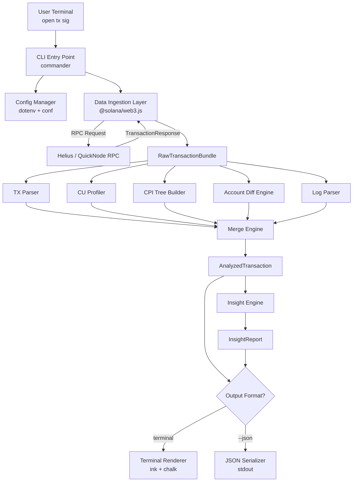
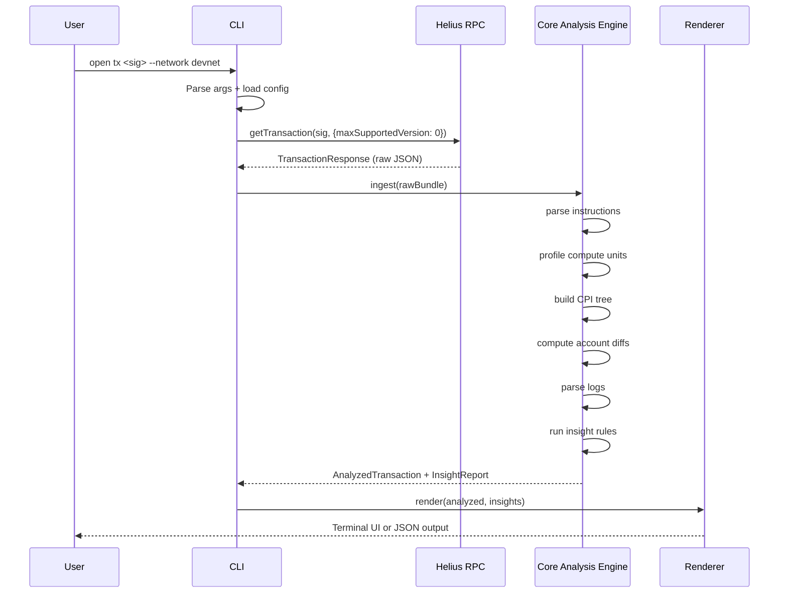
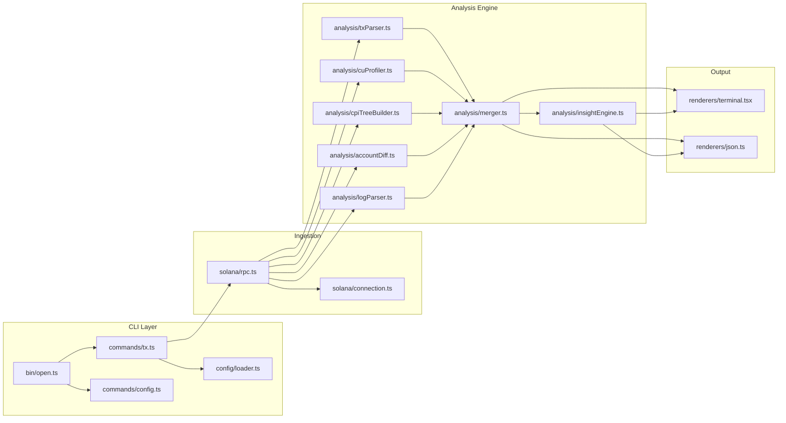
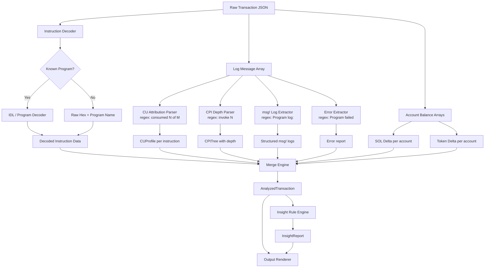

# OPEN — CLI Architecture Design
### Solana Transaction Debugger & Profiler · Hackathon MVP · 30-Day Build Plan

---
 
## Table of Contents

1. [High-Level System Architecture](#1-high-level-system-architecture)
2. [Detailed Component Breakdown](#2-detailed-component-breakdown)
3. [Suggested Tech Stack](#3-suggested-tech-stack)
4. [Data Flow](#4-data-flow)
5. [Visual Architecture Diagrams](#5-visual-architecture-diagrams)
6. [Repository Structure](#6-repository-structure)
7. [30-Day Build Plan](#7-30-day-build-plan)

---

## 1. High-Level System Architecture

The OPEN CLI is composed of **six primary layers** that form a sequential pipeline from user input to rendered output.

```
┌─────────────────────────────────────────────────────────┐
│                     CLI ENTRY POINT                     │
│              open tx <transaction_signature>            │
└────────────────────────┬────────────────────────────────┘
                         │
                         ▼
┌─────────────────────────────────────────────────────────┐
│              SOLANA DATA INGESTION LAYER                │
│     RPC Client → fetchTransaction + getAccountInfo      │
└────────────────────────┬────────────────────────────────┘
                         │
                         ▼
┌─────────────────────────────────────────────────────────┐
│              CORE ANALYSIS ENGINE                       │
│  ┌──────────────┐  ┌────────────┐  ┌─────────────────┐ │
│  │  TX Parser   │  │  CU Profiler│  │  CPI Tree Builder│ │
│  └──────────────┘  └────────────┘  └─────────────────┘ │
│  ┌──────────────┐  ┌────────────┐                       │
│  │ Account Diff │  │ Log Parser │                       │
│  └──────────────┘  └────────────┘                       │
└────────────────────────┬────────────────────────────────┘
                         │
                         ▼
┌─────────────────────────────────────────────────────────┐
│                  INSIGHT ENGINE                         │
│         Bottleneck Detection + Recommendations          │
└────────────────────────┬────────────────────────────────┘
                         │
                         ▼
┌─────────────────────────────────────────────────────────┐
│               OUTPUT RENDERER                           │
│        Terminal (ink/chalk) ←→ JSON (--json flag)       │
└─────────────────────────────────────────────────────────┘
```

### How Components Interact

- The **CLI Entry Point** parses arguments and flags, then calls the **Data Ingestion Layer**.
- The **Data Ingestion Layer** fetches raw transaction data from an RPC provider (Helius or QuickNode) and passes it as a raw transaction object to the **Core Analysis Engine**.
- The **Core Analysis Engine** runs five parallel sub-modules on the raw transaction data: the TX Parser, CU Profiler, CPI Tree Builder, Account Diff Engine, and Log Parser. Each module produces a typed data structure.
- The five typed outputs are merged into a single **`AnalyzedTransaction`** object.
- The **Insight Engine** receives the `AnalyzedTransaction` object and generates bottleneck findings and CU-saving suggestions.
- The final enriched object is passed to the **Output Renderer**, which either renders a rich terminal UI or serializes to JSON depending on the user's flags.

---

## 2. Detailed Component Breakdown

### 2.1 CLI Entry Point

**Responsibility:** Parse commands, flags, and arguments. Route to the appropriate sub-command handler. Manage configuration (RPC URL, output format, network).

**Technologies:**
- `commander` (Node.js) — argument parsing and sub-command routing
- `dotenv` — environment variable management for RPC keys
- `conf` — persistent local config store (saves preferred RPC endpoint, network)

**Input:** Raw `argv` from the terminal.

**Output:** A structured `CLIOptions` object passed to the ingestion layer:

```typescript
interface CLIOptions {
  signature: string;
  network: "mainnet" | "devnet" | "testnet";
  rpcUrl: string;
  outputFormat: "terminal" | "json";
  verbose: boolean;
}
```

**Dependencies:** None (entry point).

---

### 2.2 Solana Data Ingestion Layer

**Responsibility:** Fetch all raw data from the Solana RPC required for analysis. This includes the full transaction with metadata, pre/post account states, and program account info.

**Technologies:**
- `@solana/web3.js` — `Connection.getTransaction()` with `maxSupportedTransactionVersion: 0`
- Helius RPC (primary) or QuickNode (fallback) — required for full account data and metadata
- `axios` — for Helius-specific enhanced APIs (e.g., `getTransaction` with parsed data)

**Input:** Transaction signature string + network config.

**Output:** `RawTransactionBundle` containing:

```typescript
interface RawTransactionBundle {
  transaction: TransactionResponse;     // Full tx with meta
  preBalances: number[];                // SOL balances before
  postBalances: number[];               // SOL balances after
  preTokenBalances: TokenBalance[];     // SPL token balances before
  postTokenBalances: TokenBalance[];    // SPL token balances after
  logMessages: string[];                // Raw runtime log array
  accountKeys: PublicKey[];             // All accounts involved
  innerInstructions: InnerInstruction[]; // CPI calls
  computeUnitsConsumed: number;         // Total CU used
}
```

**Dependencies:** Network access, RPC API key.

**Important note:** Always request `commitment: "confirmed"` or `"finalized"` and set `maxSupportedTransactionVersion: 0` to support versioned transactions and Address Lookup Tables (ALTs).

---

### 2.3 Transaction Parser

**Responsibility:** Decode the raw transaction into structured, human-readable instructions. Map each instruction to its program, decode instruction data where possible (especially for Anchor programs using their IDL), and correlate top-level instructions with their corresponding CPI children.

**Technologies:**
- `@coral-xyz/anchor` — for IDL-based instruction decoding
- `@solana/spl-token` — for Token Program instruction decoding
- Custom decoders for System Program, Memo Program
- `borsh` — for manual struct deserialization when no IDL is available

**Input:** `RawTransactionBundle`

**Output:** `ParsedTransaction`:

```typescript
interface ParsedInstruction {
  index: number;
  programId: string;
  programName: string;          // Resolved via known-programs registry
  instructionName: string;      // Decoded (e.g., "transfer", "swap")
  accounts: AccountMeta[];
  decodedData: Record<string, unknown> | null;
  computeUnits: number;         // Attributed CU (from CU Profiler)
  logs: string[];               // Associated log messages
  innerInstructions: ParsedInstruction[]; // CPI children
}

interface ParsedTransaction {
  signature: string;
  slot: number;
  success: boolean;
  fee: number;
  totalComputeUnits: number;
  computeUnitLimit: number;
  instructions: ParsedInstruction[];
}
```

**Dependencies:** CU Profiler, Log Parser (outputs are merged here), Known Programs Registry.

**Known Programs Registry:** A static JSON map of well-known program IDs to human-readable names (Token Program, System Program, Jupiter Aggregator v6, Orca Whirlpool, Metaplex, etc.). This is maintained as a `programs.json` file in the repo and is critical for making CPI trees readable.

---

### 2.4 Compute Unit (CU) Profiler

**Responsibility:** Extract per-instruction CU consumption from the raw log messages. Solana runtime emits `Program X consumed Y of Z compute units` log lines — this module parses those lines and attributes CU values to each instruction and CPI call.

**Technologies:**
- Pure TypeScript — regex-based log parsing.

**Input:** `logMessages: string[]`

**Output:** `CUProfile`:

```typescript
interface CUEntry {
  programId: string;
  cuConsumed: number;
  cuLimit: number;
  percentOfBudget: number;
  instructionIndex: number;
}

interface CUProfile {
  totalConsumed: number;
  totalLimit: number;
  utilizationPercent: number;
  perInstruction: CUEntry[];
  bottleneck: CUEntry;         // The entry with highest cuConsumed
}
```

**Log parsing regex:**

```typescript
// Matches: "Program <ProgramId> consumed <N> of <M> compute units"
const CU_REGEX = /Program (\S+) consumed (\d+) of (\d+) compute units/;
```

**Dependencies:** `logMessages` from the Data Ingestion Layer.

---

### 2.5 CPI Call Tree Builder

**Responsibility:** Reconstruct the full hierarchical tree of program invocations. Solana logs follow a depth-based `invoke [N]` pattern that encodes nesting — this module parses that structure and builds a proper tree.

**Technologies:**
- Pure TypeScript — stack-based parsing algorithm.

**Input:** `logMessages: string[]`, `innerInstructions: InnerInstruction[]`

**Algorithm:**

```
stack = []
for each log line:
  if line matches "Program X invoke [N]":
    push node(X, depth=N) to stack
  if line matches "Program X success" or "Program X failed":
    pop from stack → attach as child to parent at depth N-1
  if line matches "Program X consumed N of M compute units":
    attach CU to top-of-stack node
```

**Output:** `CPITree`:

```typescript
interface CPINode {
  programId: string;
  programName: string;
  depth: number;
  cuConsumed: number;
  cuPercent: number;
  success: boolean;
  logs: string[];
  children: CPINode[];
}

interface CPITree {
  root: CPINode;
  totalDepth: number;
  nodeCount: number;
}
```

**Dependencies:** CU Profiler output for CU attribution per node.

---

### 2.6 Account Diff Engine

**Responsibility:** Compute the before/after delta for every account touched by the transaction. This includes SOL balance changes, SPL token balance changes, and (where possible) decoded account data diffs.

**Technologies:**
- `@solana/spl-token` — for token account decoding
- `@coral-xyz/anchor` — for Anchor account struct decoding via IDL
- `bignumber.js` — for precise lamport arithmetic

**Input:** `preBalances`, `postBalances`, `preTokenBalances`, `postTokenBalances`, `accountKeys`

**Output:** `AccountDiff[]`:

```typescript
interface AccountDiff {
  pubkey: string;
  label: string | null;         // e.g., "Fee Payer", "Token Account"
  role: "signer" | "writable" | "readonly" | "program";
  solDelta: number;             // in lamports (negative = SOL left)
  solDeltaFormatted: string;    // e.g., "-0.000005 SOL"
  tokenDeltas: TokenDelta[];
  dataChanged: boolean;
}

interface TokenDelta {
  mint: string;
  mintName: string | null;
  amountBefore: string;
  amountAfter: string;
  delta: string;
  decimals: number;
}
```

**Dependencies:** Data Ingestion Layer output.

---

### 2.7 Log Parser

**Responsibility:** Group raw Solana log messages by their originating program, strip the `Program log:` prefix from `msg!()` calls, and associate each log entry with its correct instruction in the CPI tree. Also identifies error logs and surfaces error codes.

**Technologies:**
- Pure TypeScript — regex and state machine.

**Input:** `logMessages: string[]`

**Output:** `ParsedLogs`:

```typescript
interface ProgramLog {
  programId: string;
  instructionIndex: number;
  messages: LogEntry[];
}

interface LogEntry {
  type: "msg" | "data" | "error" | "cu";
  content: string;
  raw: string;
}

interface ParsedLogs {
  byProgram: ProgramLog[];
  errors: string[];
  totalLines: number;
}
```

**Dependencies:** None (pure log parsing).

---

### 2.8 Insight Engine

**Responsibility:** Analyze the merged `AnalyzedTransaction` object to detect the primary bottleneck, identify optimization opportunities, and generate concrete, actionable suggestions with estimated CU savings.

**Technologies:**
- Pure TypeScript — rule-based analysis engine (no AI/LLM in MVP).

**Input:** `AnalyzedTransaction` (merged output of all analysis modules)

**Rules (MVP):**

| Rule | Trigger | Suggestion |
|---|---|---|
| CU Budget Exceeded | `utilizationPercent > 90%` | Increase CU limit or reduce CPI depth |
| Bottleneck CPI | Single node > 50% of total CU | Identify the program and suggest optimization |
| Redundant Token Account Checks | Repeated token balance reads on same account | Batch or cache account reads |
| Excessive CPI Depth | `totalDepth > 4` | Reduce nested invocations |
| Wasted CU Budget | `computeUnitLimit >> computeUnitsConsumed` | Right-size CU limit to reduce fees |
| Failed Transaction | `success === false` | Surface error log + error code + likely cause |

**Output:** `InsightReport`:

```typescript
interface Insight {
  severity: "critical" | "warning" | "info";
  title: string;
  description: string;
  affectedProgram: string | null;
  estimatedCUSavings: number | null;
  recommendation: string;
}

interface InsightReport {
  primaryBottleneck: Insight | null;
  insights: Insight[];
  optimizationScore: number;   // 0–100, 100 = perfectly optimized
}
```

**Dependencies:** All analysis modules.

---

### 2.9 Output Renderer

**Responsibility:** Present the `AnalyzedTransaction + InsightReport` to the user. Supports two modes: rich terminal UI and raw JSON.

**Technologies:**
- `ink` (React for CLIs) — for structured terminal components
- `chalk` — for colors, bold, and emphasis in simpler non-interactive output
- `cli-table3` — for tabular data (account diffs)
- `figures` — for terminal-safe Unicode symbols (✓ ✗ ⚠)

**Terminal Output Format:**

```
════════════════════════════════════════════════
  OPEN · Transaction Debugger
  4xE9f...mK7r · devnet · slot #289,441,203
  Status: ✓ SUCCESS · 142ms
════════════════════════════════════════════════

  ■ COMPUTE UNITS
  ████████████████████░░░░ 184,320 / 200,000 CU (92%)
  ⚠ Bottleneck: Orca Whirlpool (110,500 CU · 60%)

  ■ CPI CALL TREE
  Jupiter Aggregator v6           184,320 CU
  ├── Token Program                 8,200 CU
  └── Orca Whirlpool ⚠            110,500 CU  ← BOTTLENECK
      ├── Token Program              3,100 CU
      └── Metaplex Metadata         98,400 CU  ⚠
  └── System Program                2,450 CU

  ■ ACCOUNT DIFFS
  Pubkey             Role        SOL Delta     Token Delta
  4xE9...fee         Signer      -0.000142     —
  8rPQ...ata         Writable    —             +12.50 USDC
  ...

  ■ INSIGHTS
  ⚠ [CRITICAL] Orca Whirlpool consuming 60% of CU budget.
    → swap_v2 iterates 3 tick crossings unnecessarily.
      Pass the correct tick array to avoid re-derivation.
      Estimated savings: ~40,000 CU.
```

**JSON Output (`--json` flag):**

```json
{
  "signature": "4xE9f...",
  "success": true,
  "computeUnits": { "consumed": 184320, "limit": 200000 },
  "cpiTree": { ... },
  "accountDiffs": [ ... ],
  "insights": [ ... ]
}
```

**Dependencies:** All analysis modules + Insight Engine.

---

## 3. Suggested Tech Stack

### Language

| Layer | Language | Reason |
|---|---|---|
| CLI + Core Engine | **TypeScript (Node.js)** | Best Solana SDK support, fastest iteration, great tooling |
| Data parsing | TypeScript | Type safety for complex transaction structures |

> **Why not Rust?** Rust offers better performance but significantly slower development velocity. For a 30-day hackathon, TypeScript with `@solana/web3.js` is the correct trade-off. The core parsing logic is CPU-light; the bottleneck is always RPC I/O.

---

### Core Dependencies

```json
{
  "dependencies": {
    "@solana/web3.js": "^1.95.0",
    "@coral-xyz/anchor": "^0.30.0",
    "@solana/spl-token": "^0.4.0",
    "commander": "^12.0.0",
    "chalk": "^5.3.0",
    "ink": "^4.4.1",
    "cli-table3": "^0.6.3",
    "conf": "^12.0.0",
    "dotenv": "^16.0.0",
    "bignumber.js": "^9.1.0",
    "figures": "^6.0.0",
    "axios": "^1.6.0",
    "ora": "^8.0.1"
  },
  "devDependencies": {
    "typescript": "^5.4.0",
    "tsx": "^4.7.0",
    "vitest": "^1.5.0",
    "@types/node": "^20.0.0",
    "tsup": "^8.0.0"
  }
}
```

### RPC Providers

| Provider | Use | Notes |
|---|---|---|
| **Helius** | Primary | Best-in-class parsed transaction APIs, high rate limits, free tier available |
| **QuickNode** | Fallback | Reliable, broad Solana support |
| **Public RPC** | Development only | `api.mainnet-beta.solana.com` — too slow/rate-limited for production |

### Build & Distribution

- **`tsup`** — bundles TypeScript to a single Node.js binary
- **`npm publish`** — distribution via `npm i -g @open-dev/open`
- **`pkg`** (post-MVP) — compile to standalone binary (no Node.js required)

---

## 4. Data Flow

### Full flow for `open tx <signature>`

```
User types:
  open tx 4xE9fmK7r... --network devnet

1. CLI Entry Point (commander)
   ├── Parses: signature="4xE9fmK7r...", network="devnet"
   ├── Loads config: RPC_URL from .env or conf store
   └── Calls: ingestTransaction(signature, options)

2. Data Ingestion Layer (@solana/web3.js)
   ├── connection.getTransaction(signature, {
   │     maxSupportedTransactionVersion: 0,
   │     commitment: "confirmed"
   │   })
   ├── Receives: TransactionResponse (raw JSON from RPC)
   └── Returns: RawTransactionBundle

3. Core Analysis Engine (parallel execution)
   ├── txParser.parse(bundle)        → ParsedTransaction
   ├── cuProfiler.profile(bundle)    → CUProfile
   ├── cpiTreeBuilder.build(bundle)  → CPITree
   ├── accountDiff.compute(bundle)   → AccountDiff[]
   └── logParser.parse(bundle)       → ParsedLogs

4. Merge
   └── merge(parsed, cuProfile, cpiTree, diffs, logs)
       → AnalyzedTransaction

5. Insight Engine
   └── insightEngine.analyze(analyzed)
       → InsightReport

6. Output Renderer
   ├── if --json flag:
   │     console.log(JSON.stringify(analyzed + insights))
   └── else:
         renderTerminalUI(analyzed, insights)
         (ink components or chalk-formatted stdout)
```

---

## 5. Visual Architecture Diagrams

### 5.1 System Architecture Diagram



---

### 5.2 Data Flow Diagram



---

### 5.3 CLI Internal Module Diagram



---

### 5.4 Solana Transaction Analysis Pipeline



---

## 6. Repository Structure

The repository follows the standard Solana monorepo convention: `web` for the frontend, `services` for the backend, `programs` for on-chain Solana programs, and a top-level `cli` package for the terminal tool.

```
open/
├── package.json                 # Workspace root (npm workspaces or turbo)
├── turbo.json                   # Turborepo pipeline config (if used)
├── tsconfig.base.json           # Shared TS config extended by each package
├── .env.example
├── README.md
│
├── cli/                         # ← CLI tool (open tx <sig>)
│   ├── package.json
│   ├── tsconfig.json
│   ├── tsup.config.ts
│   ├── bin/
│   │   └── open.ts              # Entry point (#!/usr/bin/env node)
│   ├── src/
│   │   ├── commands/
│   │   │   ├── tx.ts            # `open tx <sig>` command handler
│   │   │   └── config.ts        # `open config set/get` command
│   │   ├── config/
│   │   │   ├── loader.ts        # Load RPC URL, network from env/conf
│   │   │   └── defaults.ts      # Default RPC endpoints, CU limits
│   │   ├── renderers/
│   │   │   ├── terminal/
│   │   │   │   ├── index.tsx    # Root ink component
│   │   │   │   ├── Header.tsx   # Transaction status bar
│   │   │   │   ├── CUBar.tsx    # Compute unit usage bar
│   │   │   │   ├── CPITree.tsx  # Indented CPI tree view
│   │   │   │   ├── AccountTable.tsx
│   │   │   │   └── Insights.tsx # Bottleneck + recommendations panel
│   │   │   └── json.ts          # Serialize AnalyzedTransaction to JSON
│   │   └── utils/
│   │       ├── formatting.ts    # Lamports → SOL, CU % formatters
│   │       ├── pubkey.ts        # Shorten pubkeys (4xE9f...mK7r)
│   │       └── logger.ts        # Debug logging (--verbose flag)
│   └── tests/
│       └── integration/
│           └── tx-command.test.ts
│
├── services/                    # ← Backend analysis engine (Node.js)
│   ├── package.json
│   ├── tsconfig.json
│   ├── src/
│   │   ├── solana/
│   │   │   ├── connection.ts    # Create/cache @solana/web3.js Connection
│   │   │   ├── rpc.ts           # Fetch raw transaction + account data
│   │   │   └── programs.ts      # Known programs registry (ID → name map)
│   │   ├── analysis/
│   │   │   ├── types.ts         # All shared TypeScript interfaces
│   │   │   ├── txParser.ts      # Decode instructions via IDL + known decoders
│   │   │   ├── cuProfiler.ts    # Parse CU consumption from logs
│   │   │   ├── cpiTreeBuilder.ts# Build CPI call tree from log depth markers
│   │   │   ├── accountDiff.ts   # Compute pre/post balance and token diffs
│   │   │   ├── logParser.ts     # Group and structure raw log messages
│   │   │   ├── merger.ts        # Merge all outputs → AnalyzedTransaction
│   │   │   └── insightEngine.ts # Rule-based bottleneck detection
│   │   ├── api/                 # REST API (for web app consumption, post-MVP)
│   │   │   ├── server.ts        # Express/Hono server entry point
│   │   │   └── routes/
│   │   │       └── tx.ts        # POST /api/tx { signature, network }
│   │   └── data/
│   │       └── programs.json    # Known program ID → name mappings
│   └── tests/
│       ├── fixtures/
│       │   ├── tx-success.json  # Real devnet transaction snapshots
│       │   ├── tx-failed.json
│       │   └── tx-complex-cpi.json
│       └── analysis/
│           ├── cuProfiler.test.ts
│           ├── cpiTreeBuilder.test.ts
│           ├── accountDiff.test.ts
│           └── logParser.test.ts
│
├── web/                         # ← Frontend (React, post-MVP)
│   ├── package.json
│   ├── tsconfig.json
│   ├── vite.config.ts
│   ├── index.html
│   └── src/
│       ├── main.tsx
│       ├── App.tsx
│       ├── components/
│       │   ├── FlameGraph.tsx   # CU flame graph visualization
│       │   ├── CPITree.tsx      # Interactive CPI tree
│       │   ├── AccountDiff.tsx  # Account state diff table
│       │   └── Insights.tsx     # Bottleneck panel
│       ├── hooks/
│       │   └── useTransaction.ts# Calls services API
│       └── lib/
│           └── api.ts           # HTTP client → services/api
│
└── programs/                    # ← On-chain Solana programs (Anchor), if needed
    ├── Anchor.toml
    ├── Cargo.toml
    └── src/
        └── lib.rs               # Placeholder — not required for CLI MVP
```

### Dependency graph between packages

```
cli  →  services  (imports analysis engine + solana modules directly)
web  →  services  (calls REST API over HTTP)
programs  →  (standalone, deployed on-chain — no JS dependency)
```

> **For the 30-day hackathon MVP**, only `cli` and `services` are actively built. The `web` folder is scaffolded (e.g., via `npm create vite`) but left mostly empty until Week 4. The `programs` folder is a placeholder — OPEN does not require any custom on-chain program to function.

---

## 7. 30-Day Build Plan

### Overview

| Phase | Days | Goal |
|---|---|---|
| **Week 1** | Days 1–7 | Foundation: repo, RPC, raw data, log parsing |
| **Week 2** | Days 8–14 | Core analysis: CU profiler, CPI tree, account diff |
| **Week 3** | Days 15–21 | Integration: merger, insight engine, terminal renderer |
| **Week 4** | Days 22–30 | Polish, testing, JSON output, demo transactions |

---

### Week 1 — Foundation (Days 1–7)

**Goal:** Get real transaction data out of Solana and into structured TypeScript objects. Prove the pipeline works end-to-end before building analysis.

- [ ] **Day 1–2:** Initialize repository. Set up TypeScript, `tsup`, `vitest`, ESLint. Create `bin/open.ts` entry point with `commander`. Implement `open config set rpc <url>` command. Write `solana/connection.ts` and verify RPC connection to Helius devnet.
- [ ] **Day 3–4:** Implement `solana/rpc.ts`. Successfully call `getTransaction()` and print raw `TransactionResponse` to stdout. Handle edge cases: missing transaction, network errors, versioned transactions.
- [ ] **Day 5–6:** Implement `analysis/logParser.ts`. Parse the `logMessages` array into `ParsedLogs`. Write unit tests against 3 real devnet transaction log fixtures.
- [ ] **Day 7:** Implement `solana/programs.ts` — the known programs registry. Populate with at minimum: System Program, Token Program, Token-2022, Associated Token Program, Memo Program, Metaplex, Jupiter v6, Orca Whirlpool, Raydium. This unblocks human-readable output for all analysis modules.

**Week 1 exit criteria:** `open tx <sig>` prints raw structured JSON to stdout with log messages grouped by program.

---

### Week 2 — Core Analysis (Days 8–14)

**Goal:** Build the three most valuable analysis modules: CU Profiler, CPI Tree Builder, Account Diff Engine.

- [ ] **Day 8–9:** Implement `analysis/cuProfiler.ts`. Parse CU consumption per instruction from log messages using regex. Identify the bottleneck instruction. Write unit tests.
- [ ] **Day 10–11:** Implement `analysis/cpiTreeBuilder.ts`. Build the full CPINode tree using the stack-based `invoke [N]` parsing algorithm. Attribute CU to each node from the CU Profiler. Test against a multi-CPI transaction (e.g., a Jupiter swap).
- [ ] **Day 12–13:** Implement `analysis/accountDiff.ts`. Compute SOL deltas and SPL token deltas. Label accounts by role (signer, writable, program). Write unit tests.
- [ ] **Day 14:** Implement `analysis/txParser.ts`. Decode top-level instructions using the programs registry. Integrate Anchor IDL decoding for the most common programs. Merge `ParsedInstruction` with CU data and logs.

**Week 2 exit criteria:** `analysis/merger.ts` can produce a complete `AnalyzedTransaction` from all module outputs. All modules have unit tests with >80% coverage on fixtures.

---

### Week 3 — Integration & Rendering (Days 15–21)

**Goal:** Connect the pipeline and build the terminal renderer. Achieve the core "wow moment" — visible bottleneck in under 3 seconds.

- [ ] **Day 15:** Implement `analysis/merger.ts`. Wire all analysis modules into a single function that produces `AnalyzedTransaction`. Integrate into the `tx` command.
- [ ] **Day 16:** Implement `analysis/insightEngine.ts`. Build the rule engine with the 6 MVP rules (see Component 2.8). Each rule must produce a typed `Insight` object.
- [ ] **Day 17–18:** Implement `renderers/terminal/` using `ink`. Build `Header.tsx` (transaction status), `CUBar.tsx` (compute unit usage bar with ASCII chart), and `CPITree.tsx` (indented tree with CU annotations). Focus on clarity, not aesthetics.
- [ ] **Day 19–20:** Implement `renderers/terminal/AccountTable.tsx` and `renderers/terminal/Insights.tsx`. The insights panel is the highest-value output — spend time making recommendations clear and actionable.
- [ ] **Day 21:** End-to-end test with 5 real transactions (success, failed, high-CU, deep-CPI, simple transfer). Validate that the output is correct and readable for all cases.

**Week 3 exit criteria:** `open tx <sig>` produces a complete, correct, readable terminal output including CPI tree, CU bar, account diffs, and at least one insight for complex transactions.

---

### Week 4 — Polish, JSON Output & Hackathon Prep (Days 22–30)

**Goal:** Production-ready CLI, `--json` flag for structured output, demo materials, npm publish.

- [ ] **Day 22:** Implement `renderers/json.ts`. Ensure the JSON output is complete, consistently structured, and machine-readable for CI/CD integration.
- [ ] **Day 23:** Implement `--verbose` flag for debug logging. Implement error handling for all failure modes: transaction not found, RPC timeout, unsupported transaction version, parse failure.
- [ ] **Day 24:** Write integration tests in `tests/integration/tx-command.test.ts`. Test the full CLI pipeline against fixture files.
- [ ] **Day 25–26:** Build the `data/programs.json` known-programs registry to be as comprehensive as possible. Add Anchor IDL decoding for Orca Whirlpool, Jupiter v6, and Raydium — these are the programs that appear in the most DeFi transactions and make the CPI tree most readable.
- [ ] **Day 27:** Polish terminal output. Improve color scheme, spacing, and truncation for long pubkeys. Ensure the output looks excellent in VS Code integrated terminal, iTerm2, and a standard Linux terminal.
- [ ] **Day 28:** Write `README.md` with installation instructions, quickstart, and 3 example outputs. Create a `DEMO.md` with 3 pre-selected transaction signatures on devnet that showcase the tool's value (a bottlenecked swap, a failed transaction, a clean simple transfer).
- [ ] **Day 29:** `npm publish @open-dev/open`. Test installation via `npm i -g @open-dev/open` on a clean machine. Fix any packaging issues.
- [ ] **Day 30:** Rehearse the hackathon demo. The demo should show: `npm i -g @open-dev/open` → `open tx <bottlenecked-swap-sig>` → visible bottleneck and insight in under 3 seconds. Prepare a 2-minute walkthrough.

**Week 4 exit criteria:** Published npm package. Three polished demo transactions. README with output screenshots. Sub-3-second time-to-insight validated on demo transactions.

---

### Post-Hackathon (If Time Permits)

These features are deliberately excluded from the MVP to protect the 30-day timeline:

- **Web interface** — Generate using Lovable or v0 from the JSON output schema.
- **Anchor IDL auto-fetch** — Fetch IDLs from on-chain account data automatically.
- **Transaction Diff (v1 vs v2)** — Compare two signatures side-by-side.
- **Time-Travel Debugging** — Replay account state at specific slots.
- **Sharable links** — Persist analysis results and generate URLs.
- **Pro tier + payment rails** — USDC/SOL subscription via Stripe or on-chain.

---

## Appendix: Key Design Decisions

| Decision | Choice | Rationale |
|---|---|---|
| Language | TypeScript | Best Solana SDK support, fastest iteration for hackathon |
| RPC Provider | Helius | Superior parsed APIs, generous free tier, good rate limits |
| CU Attribution | Log parsing (not simulation) | Works on mainnet/devnet real transactions without re-simulation |
| Insight Engine | Rule-based (no LLM) | Deterministic, fast, no API cost, works offline |
| Terminal Renderer | ink (React) | Component-based, testable, handles complex layouts |
| CPI Tree Algorithm | Stack-based log parser | `invoke [N]` depth markers in Solana logs are reliable and always present |
| Distribution | npm global install | Zero friction for developers; aligns with CLI-first strategy |
| Testing | Fixture-based (real tx snapshots) | Faster than live RPC calls in tests, deterministic, no rate limits |
