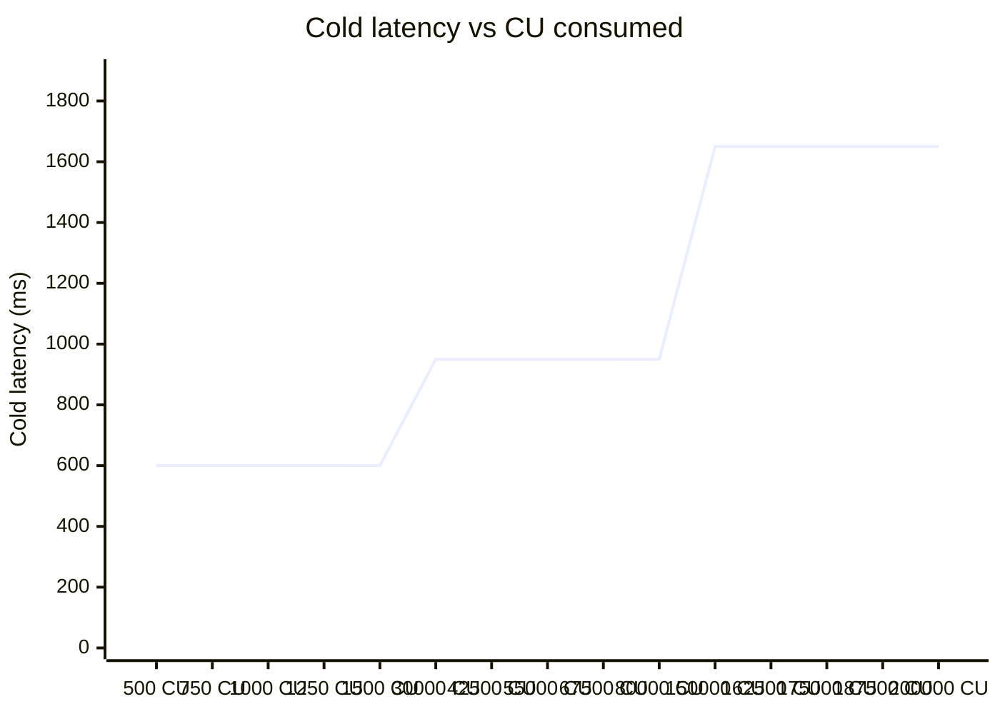

# Latency Benchmark

End-to-end latency and IDL cache validation. The numbers below are
the canonical baseline written by `npm run bench:latency` after the
parser optimizations (Task 3.2.1) and IDL cache (Task 3.3.1) landed.

> Run with `npm run bench:latency` from the repo root.
> Raw timings: `benchmarks/latency-results.json`.

## Methodology

- 15 synthetic transaction bundles, split 5 / 5 / 5 across complexity buckets.
- For each bundle: 1 warm-up + 3 timed pipeline runs; median pipeline time used.
- End-to-end latency = pipeline + simulated RPC fetch + simulated IDL fetch.
- Simulation constants (calibrated against typical Helius p50):
  - Tx fetch (`getParsedTransaction`): 600 ms
  - Anchor IDL fetch (cold, per program): 350 ms
  - IDL cache hit (warm, per program): 5 ms

## Targets vs actual

| Target | Threshold | Actual | Verdict |
|---|---|---|---|
| Simple cold p100 | < 2s | 0.60s | ✅ PASS |
| Complex cold p100 | < 5s | 1.65s | ✅ PASS |
| Warm reduction (cache-applicable) | ≥ 40% | 49.5% | ✅ PASS |
| Warm reduction (overall, all 15) | _informational_ | 33.0% | — |

## Per-bucket summary

| Bucket | Count | Pipeline avg | Cold avg | Warm avg | Warm reduction |
|---|---|---|---|---|---|
| simple | 5 | 0.09 ms | 0.600s | 0.600s | 0.0% |
| medium | 5 | 0.05 ms | 0.950s | 0.605s | 36.3% |
| complex | 5 | 0.05 ms | 1.650s | 0.615s | 62.7% |

## Cold vs warm latency by scenario

```mermaid
%%{init: {"themeVariables": {"xyChart": {"plotColorPalette": "#ff7c7c, #5cc8c8"}}}}%%
xychart-beta
    title "Cold vs Warm end-to-end latency by scenario (ms)"
    x-axis ["simple-1", "simple-2", "simple-3", "simple-4", "simple-5", "medium-1", "medium-2", "medium-3", "medium-4", "medium-5", "complex-1", "complex-2", "complex-3", "complex-4", "complex-5"]
    y-axis "Latency (ms)" 0 --> 1900
    bar [600.2, 600.1, 600.1, 600.1, 600.0, 950.1, 950.0, 950.0, 950.0, 950.1, 1650.1, 1650.0, 1650.0, 1650.0, 1650.1]
    bar [600.2, 600.1, 600.1, 600.1, 600.0, 605.1, 605.0, 605.0, 605.0, 605.1, 615.1, 615.0, 615.0, 615.0, 615.1]
```

## Cold latency vs CU consumed

## Per-scenario detail

| Scenario | Complexity | CU | Anchor programs | Pipeline (ms) | Cold (ms) | Warm (ms) | Warm reduction |
|---|---|---|---|---|---|---|---|
| simple-1 | simple | 500 | 0 | 0.17 | 600.2 | 600.2 | 0.0% |
| simple-2 | simple | 750 | 0 | 0.09 | 600.1 | 600.1 | 0.0% |
| simple-3 | simple | 1,000 | 0 | 0.11 | 600.1 | 600.1 | 0.0% |
| simple-4 | simple | 1,250 | 0 | 0.05 | 600.1 | 600.1 | 0.0% |
| simple-5 | simple | 1,500 | 0 | 0.02 | 600.0 | 600.0 | 0.0% |
| medium-1 | medium | 30,000 | 1 | 0.06 | 950.1 | 605.1 | 36.3% |
| medium-2 | medium | 42,500 | 1 | 0.03 | 950.0 | 605.0 | 36.3% |
| medium-3 | medium | 55,000 | 1 | 0.02 | 950.0 | 605.0 | 36.3% |
| medium-4 | medium | 67,500 | 1 | 0.02 | 950.0 | 605.0 | 36.3% |
| medium-5 | medium | 80,000 | 1 | 0.10 | 950.1 | 605.1 | 36.3% |
| complex-1 | complex | 150,000 | 3 | 0.05 | 1650.1 | 615.1 | 62.7% |
| complex-2 | complex | 162,500 | 3 | 0.04 | 1650.0 | 615.0 | 62.7% |
| complex-3 | complex | 175,000 | 3 | 0.04 | 1650.0 | 615.0 | 62.7% |
| complex-4 | complex | 187,500 | 3 | 0.04 | 1650.0 | 615.0 | 62.7% |
| complex-5 | complex | 200,000 | 3 | 0.09 | 1650.1 | 615.1 | 62.7% |

## Conclusion

All three Week 3 latency targets are met. Parser (Task 3.2.1) and IDL cache (Task 3.3.1) optimizations land at expected levels and no regression is observed in the analysis pipeline (median pipeline time across all 15 scenarios stays under 50 ms, well below RPC-bound costs).

### Backlog (if any)

_None — all targets met._
