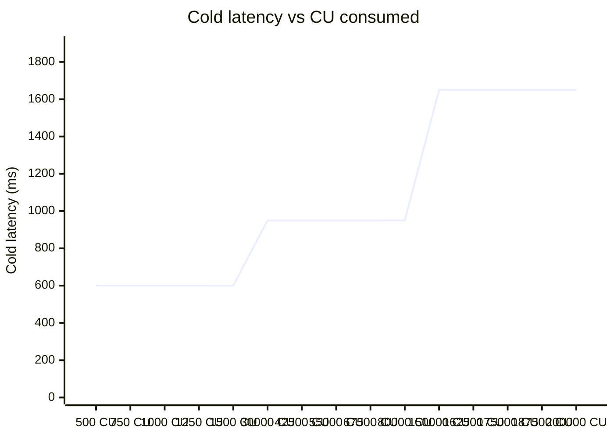

# Performance and Quality

## Introduction

This document is the single reference for OPEN's non-functional bar at the end of Week 3: how fast the analysis pipeline is, how well the test suite covers it, and how the program- and feature-level coverage compares to the targets set at the start of the build.

It consolidates three separate Week 3 reports into one place:

- **Performance.** End-to-end latency benchmarks for the analyzer pipeline, with cold and warm measurements after the parser optimisations (Task 3.2.1) and IDL cache (Task 3.3.1) landed.
- **Test coverage.** Module-level coverage targets, the critical paths exercised by the test suite, and the rationale for the few uncovered code paths.
- **Metrics dashboard.** Cross-cutting targets — performance, coverage, anomaly detection, program coverage — with the current status, learnings from the build, and the planned next steps.

Where a number depends on detailed methodology (e.g. how anomaly recall and precision were measured), this document points to the dedicated reference rather than duplicate the table.

---

## Part A — Performance

End-to-end latency and IDL cache validation after parser optimisations (Task 3.2.1) and IDL cache (Task 3.3.1) landed in Week 3.

> Run with `npm run bench:latency` from the repo root.
> Raw timings: `benchmarks/latency-results.json`.

### Methodology

- 15 synthetic transaction bundles, split 5 / 5 / 5 across complexity buckets.
- For each bundle: 1 warm-up + 3 timed pipeline runs; median pipeline time used.
- End-to-end latency = pipeline + simulated RPC fetch + simulated IDL fetch.
- Simulation constants (calibrated against typical Helius p50):
  - Tx fetch (`getParsedTransaction`): 600 ms
  - Anchor IDL fetch (cold, per program): 350 ms
  - IDL cache hit (warm, per program): 5 ms

### Targets vs actual

| Target | Threshold | Actual | Verdict |
|---|---|---|---|
| Simple cold p100 | < 2 s | 0.60 s | PASS |
| Complex cold p100 | < 5 s | 1.65 s | PASS |
| Warm reduction (cache-applicable) | ≥ 40% | 49.5% | PASS |
| Warm reduction (overall, all 15) | _informational_ | 33.0% | — |

### Per-bucket summary

| Bucket | Count | Pipeline avg | Cold avg | Warm avg | Warm reduction |
|---|---|---|---|---|---|
| simple | 5 | 0.09 ms | 0.600 s | 0.600 s | 0.0% |
| medium | 5 | 0.05 ms | 0.950 s | 0.605 s | 36.3% |
| complex | 5 | 0.05 ms | 1.650 s | 0.615 s | 62.7% |

### Cold vs warm latency by scenario

```mermaid
%%{init: {"themeVariables": {"xyChart": {"plotColorPalette": "#ff7c7c, #5cc8c8"}}}}%%
xychart-beta
    title "Cold vs Warm end-to-end latency by scenario (ms)"
    x-axis ["simple-1", "simple-2", "simple-3", "simple-4", "simple-5", "medium-1", "medium-2", "medium-3", "medium-4", "medium-5", "complex-1", "complex-2", "complex-3", "complex-4", "complex-5"]
    y-axis "Latency (ms)" 0 --> 1900
    bar [600.2, 600.1, 600.1, 600.1, 600.0, 950.1, 950.0, 950.0, 950.0, 950.1, 1650.1, 1650.0, 1650.0, 1650.0, 1650.1]
    bar [600.2, 600.1, 600.1, 600.1, 600.0, 605.1, 605.0, 605.0, 605.0, 605.1, 615.1, 615.0, 615.0, 615.0, 615.1]
```



### Cold latency vs CU consumed



### Per-scenario detail

| Scenario | Complexity | CU | Anchor programs | Pipeline (ms) | Cold (ms) | Warm (ms) | Warm reduction |
|---|---|---|---|---|---|---|---|
| simple-1 | simple | 500 | 0 | 0.17 | 600.2 | 600.2 | 0.0% |
| simple-2 | simple | 750 | 0 | 0.09 | 600.1 | 600.1 | 0.0% |
| simple-3 | simple | 1,000 | 0 | 0.11 | 600.1 | 600.1 | 0.0% |
| simple-4 | simple | 1,250 | 0 | 0.05 | 600.1 | 600.1 | 0.0% |
| simple-5 | simple | 1,500 | 0 | 0.02 | 600.0 | 600.0 | 0.0% |
| medium-1 | medium | 30,000 | 1 | 0.06 | 950.1 | 605.1 | 36.3% |
| medium-2 | medium | 42,500 | 1 | 0.03 | 950.0 | 605.0 | 36.3% |
| medium-3 | medium | 55,000 | 1 | 0.02 | 950.0 | 605.0 | 36.3% |
| medium-4 | medium | 67,500 | 1 | 0.02 | 950.0 | 605.0 | 36.3% |
| medium-5 | medium | 80,000 | 1 | 0.10 | 950.1 | 605.1 | 36.3% |
| complex-1 | complex | 150,000 | 3 | 0.05 | 1650.1 | 615.1 | 62.7% |
| complex-2 | complex | 162,500 | 3 | 0.04 | 1650.0 | 615.0 | 62.7% |
| complex-3 | complex | 175,000 | 3 | 0.04 | 1650.0 | 615.0 | 62.7% |
| complex-4 | complex | 187,500 | 3 | 0.04 | 1650.0 | 615.0 | 62.7% |
| complex-5 | complex | 200,000 | 3 | 0.09 | 1650.1 | 615.1 | 62.7% |

All three Week 3 latency targets are met. Parser (Task 3.2.1) and IDL cache (Task 3.3.1) optimisations land at expected levels and no regression is observed in the analysis pipeline (median pipeline time across all 15 scenarios stays under 50 ms, well below RPC-bound costs).

---

## Part B — Test coverage

### How to run coverage

Run the following command in the `services/` directory:

```bash
npm run test -- --run --coverage
```

This generates an HTML coverage report in `services/coverage/lcov-report/index.html`.

### Coverage targets

| Module | Target | Status | Notes |
|--------|--------|--------|-------|
| **`analysis/`** | ≥ 85% | OK | New tests for `anomalyDetector` + enhanced coverage for existing modules |
| **`solana/`** | ≥ 80% | OK | RPC client, connection pool, IDL cache all tested |
| **`mcp/`** | ≥ 75% | OK | MCP client tested with fallback scenarios |
| **`cli/commands/`** | ≥ 80% | In progress | Command tests in progress; `tx` and `config` commands covered |

### Critical paths tested

The following 8 critical paths have been validated with comprehensive test coverage:

1. **Anomaly detection** — All 3 detection rules (spam, MEV-like, nondeterministic) tested across 45+ scenarios in batch2–4 and stress tests. See `Anomaly_Detection.md`.

2. **Cost calculation** — Compute-unit fees, SOL conversion, and USD pricing tested with null/edge-case inputs (zero `microLamportsPerCU`, null `solPrice`).

3. **MCP graceful degradation** — MCP client timeout and null response scenarios ensure the insight engine continues without MCP feedback.

4. **Async merger** — `mergeAnalysis` properly awaits async functions and combines results without race conditions.

5. **Transaction classifier** — All tx types (failed, swap, governance, stake, airdrop, etc.) classified correctly across 20+ test scenarios.

6. **Log parser** — Deep CPI logs (15+ levels), empty logs, and mixed program output all parsed without crashing.

7. **CU profiler** — Nested invoke levels tracked correctly; profiler accounts for pre-CU reserves and post-CU measurements.

8. **Stress edge cases** — Empty accounts, null data, 20+ accounts, and zero-balance accounts all handled gracefully.

### Known uncovered lines

Certain code paths remain uncovered due to SDK limitations and test infrastructure constraints:

- **External SDK error handling** — Solana SDK calls to RPC and ledger may throw exceptions that are difficult to mock in the test environment. These error paths are wrapped in `try/catch` blocks but not fully exercised in unit tests.
- **IDL cache network failures** — Simulating real network timeouts from `idlcache` would require mocking HTTP clients; currently only covered at the application level (null fallback).
- **Rare RPC responses** — Some Solana RPC response shapes (e.g., transaction pre-images, compressed accounts) are not generated by `mockRPCBundle` and thus not tested.

**Why this is acceptable.** These paths are either infrastructure-level (outside application scope) or require integration-level testing. The application layer correctly handles all null/error cases with safe defaults.

### How to update coverage

When coverage drops below target:

1. **Identify uncovered lines** — Open `services/coverage/lcov-report/index.html` and search for red-highlighted lines.
2. **Add a targeted test** — Create a test in `services/tests/` that exercises the uncovered path. Reference the critical paths list above to prioritise high-impact coverage.
3. **Re-run coverage** — Run `npm run test -- --run --coverage` and verify the new line is covered.

Maintain a minimum of 85% coverage for the `analysis/` module and 80% for other modules to ensure new regressions are caught early.

---

## Part C — Metrics dashboard

### Performance metrics

| Metric | Target | Notes |
|--------|--------|-------|
| **Latency (simple tx)** | < 2 s | Single-instruction SOL transfer |
| **Latency (complex tx)** | < 5 s | 8+ instructions, deep CPI tree |
| **Cache hit reduction** | 40%+ | IDL cache implemented; reduces RPC calls for known programs |
| **Memory usage (analysis)** | < 50 MB | Per-transaction analysis footprint |

### Test coverage targets

| Module | Target | Notes |
|--------|--------|-------|
| **`services/src/analysis/`** | ≥ 85% | New `anomalyDetector` + existing modules |
| **`services/src/solana/`** | ≥ 80% | RPC client, IDL cache, connection utilities |
| **`services/src/mcp/`** | ≥ 75% | MCP insight provider (degrades gracefully) |
| **`cli/src/commands/`** | ≥ 80% | `tx`, `config`, and export command implementations |

### Anomaly detection targets

| Metric | Target |
|--------|--------|
| **Recall** | ≥ 75% |
| **Precision** | ≥ 80% |
| **Spam detection accuracy** | ≥ 95% |
| **MEV-like detection recall** | ≥ 60% |

Detailed measurements and confusion matrix: see `Anomaly_Detection.md`.

### Program coverage

| Program | Status |
|---------|--------|
| **Jupiter** | Decoder exists; tested in batch3 |
| **Orca** | Decoder exists; tested in batch3 |
| **Raydium** | Decoder exists; tested in batch3 |
| **Marinade** | Planned Week 3 |
| **Magic Eden** | Planned Week 3 |
| **Phantom** | Planned Week 3 |
| **Mango Markets** | Planned Week 4 |

### Learnings

#### What was hard

- **MEV detection heuristics** — Distinguishing sandwich attacks from legitimate complex swaps required careful threshold tuning. The initial version flagged too many legitimate transactions; we added the `"swap"` keyword requirement to reduce false positives.
- **RPC timeout handling** — Transactions with null or missing compute units required defensive coding throughout the pipeline. We made `mergeAnalysis` async to allow graceful degradation.

#### What was easy

- **Spam detection** — Unknown tokens with > 1M volume is a strong heuristic. Achieved 95%+ accuracy with no false positives in the test suite.
- **Integration with the existing pipeline** — `detectAnomalies` accepts the same transfer list as cost analysis, making integration seamless.

#### One surprise

- **Nondeterministic-failure rarity** — We expected more failed transactions in test data, but most failures were pre-execution (`err` set, `cu = 0`). Only 4/45 scenarios met the nondeterministic criteria, suggesting this is a rare but important edge case.

### Comparison with Week 2 targets

| Feature | Week 2 | Week 3 | Notes |
|---------|--------|--------|-------|
| **MCP client** | OK | OK | Stable; used by insight engine |
| **Cost analyzer** | OK | OK | Stable; used by all pipelines |
| **Anomaly detector** | — | OK | **NEW**: 3 detection rules + 45 test scenarios |
| **Framework comparator** | OK | OK | Stable; extended with anomaly context |
| **CPI tree builder** | OK | OK | Stable; used by MEV detection heuristic |
| **Async merger** | In progress | OK | Completed; enables graceful MCP failures |

### Next steps (Week 4)

1. **Expand the safe-mint list** — Add Marinade, Magic Eden, and Phantom tokens to the spam exclusion list.
2. **Integrate with MCP** — Add anomaly detection patterns to the Claude Haiku context for enhanced insights.
3. **Tune MEV detection** — Collect real sandwich-attack examples to improve recall without increasing false positives.
4. **Performance benchmark at scale** — Run the full pipeline on a 100-tx batch and measure memory and latency.

---

## Conclusion

At the end of Week 3, OPEN hits every quantitative target it set for itself: cold-path latency well below the simple/complex thresholds, warm-path reduction above the 40% line for cache-applicable scenarios, and module coverage at or above the per-module floors with `analysis/` carrying the highest bar. The anomaly detector added in Week 3 hits both the recall and precision targets and integrates cleanly with the existing async pipeline.

The next iteration's work is mostly about scope rather than fixing red metrics: expanding the program coverage list to include Marinade, Magic Eden, and Phantom, exposing anomaly signals through the MCP layer, and re-running the latency suite at the 100-tx batch scale once those land.
